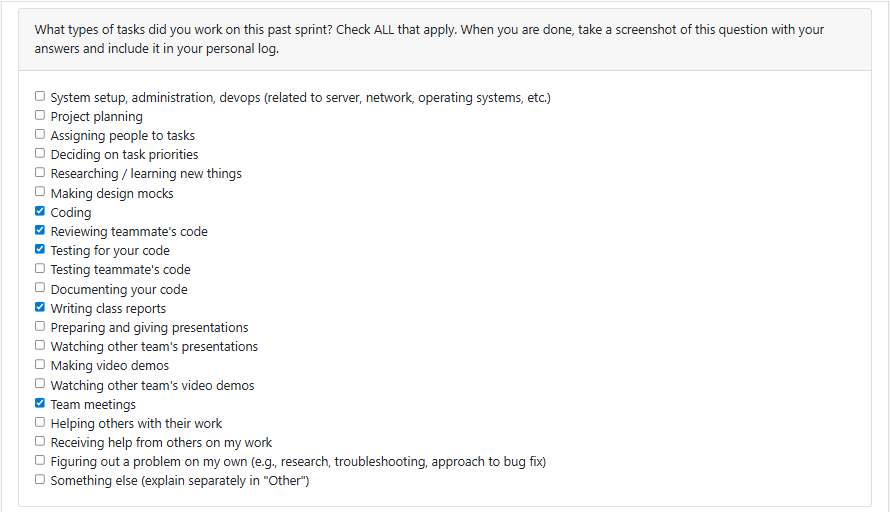

## Weekly Navigation

- [Term 2 – Week 1 (Jan 5–Jan 11, 2026)](#log-12)
- [Term 2 – Week 2 (Jan 12–Jan 18, 2026)](#log-13)
- [Term 2 – Week 3 (Jan 19–Jan 25, 2026)](#log-14)
- [Term 2 – Week 4 (Jan 26–Feb 1, 2026)](#log-15)
- [Term 2 – Week 5 (Feb 2–Feb 8, 2026)](#log-16)
- [Term 2 – Week 6 (Feb 9–Feb 15, 2026)](#log-17)
- [Term 2 – Week 7 (Feb 16–Feb 22, 2026)](#log-18)
- [Term 2 – Week 8 (Feb 23–Mar 1, 2026)](#log-19)
- [Term 2 – Week 9 (Mar 2–Mar 8, 2026)](#log-20)

- [Week 11 (Dec 1–Dec 7, 2025)](#log-11)
- [Week 10 (Nov 24–Nov 30, 2025)](#log-10)
- [Week 9 (Nov 17–Nov 23, 2025)](#log-9)
- [Week 8 (Nov 3–Nov 9, 2025)](#log-8)
- [Week 7 (Oct 27–Nov 2, 2025)](#log-7)
- [Week 6 (Oct 20–Oct 26, 2025)](#log-6)
- [Week 5 (Oct 13–Oct 19, 2025)](#log-5)
- [Week 4 (Sept 22–Sept 28, 2025)](#log-2)
- [Week 3 (Sept 15–Sept 21, 2025)](#log-1)

## Log 1:
## Date Range: Weeks 3 - Sept 15-21, 2025

## 

## Recap on your week's goals

During this period, our team discussed and refined the functional and non-functional requirements for the project. My personal focus was on researching similar projects online to better understand common requirements and best practices that could be relevant to our work. This helped me think critically about what features might be necessary and what constraints we should consider. My goals for the week were mainly to contribute to shaping our requirements document and ensure I had enough context to give meaningful input. 

## Log 2:
## Date Range: Week 4 - Sept 22-28, 2025

## 

## Recap on your week's goals

This week, I worked closely with my team on building the system architecture and developing the project proposal. My main contributions included identifying and listing all the use cases for our system, as well as creating the workload distribution table to ensure tasks were divided fairly and efficiently among team members. I also took part in every team meeting, where I actively contributed to discussions, shared ideas, and provided feedback.

## Log 3:
## Date Range: Week 5 - Sept 29-Oct 5, 2025

## 

## Recap on your week's goals

This week, I helped design the Data Flow Diagram by creating the processes and mapping out how data moves between them. I worked on building the diagram in Figma, making sure it was clear, well-organized, and visually consistent with our project standards.

## Log 4:
## Date Range: Week 5 - Oct 5 - Oct 12, 2025

## 

## Recap on your week's goals

This week, I updated the Kanban board and, together with Maya, assigned tasks to everyone in the group. I also attended the team meeting on Monday. On the development side, I added a zip file handler and created as well as reviewed and approved pull requests on GitHub. I also researched which frameworks would be best suited for our project.

## Log 5:
## Date Range: Week 5 - Oct 13 - Oct 19, 2025

## 

## Recap on your week's goals

This week, I worked on issue #2 on the Kanban board. I focused on building the feature that prompts users to enter a file path and then processes the file based on its format. The system can now handle multiple file types including `.csv`, `.json`, `.txt`, `.py`, and `.zip`. It also automatically performs the correct parsing or reading operations for each. Additionally, I implemented detailed error handling to manage invalid inputs and potential edge cases, along with unit tests to verify that the feature behaves reliably across scenarios. For next week, I plan to implement functionality for storing user configurations and start analyzing project files to extract useful insights and support upcoming features.

## Log 6:
## Date Range: Week 6 - Oct 20 - Oct 26, 2025

## 

## Recap on your week's goals

### What I Worked On This Week
This week, I completed a major database refactor. I expanded the Project model with 15+ new fields (importance scoring, featured flags, skills/tags, user customization), enhanced the File and Contributor models with additional metadata and contribution tracking, and introduced a new Keyword model for skill extraction. I also added thorough test coverage for all changes.

### Plan for Next Week
Next week, I will research AI/LLM integration opportunities for our system, focusing on how we can use AI-driven analysis in our artifact mining workflow while preserving user privacy and consent.

## Log 7:
## Date Range: Week 7 - Oct 27 - Nov 2, 2025

## 

## Recap on your week's goals

### What I Worked On This Week
This week, I focused on implementing the basic AI integration for our system through the Google Gemini 2.5 Flash API, emphasizing cost optimization and performance monitoring. I successfully integrated rate limiting, response caching, cost tracking and usage monitoring features, along with a console dashboard for better visibility and management (https://github.com/COSC-499-W2025/capstone-project-team-13/issues/97). In addition, I developed a comprehensive test suite to ensure the reliability of the AI functionality. Alongside this, I rewrote the "main.py" file to implement a more complete project analysis pipeline - adding consent checks, file format validation, project duplication handling, database integration, and dynamic routing to analyzers based on content type (code, text, or media). This overhaul was aimed at improving the overall user experience and laying a stronger foundation for future AI-driven features (https://github.com/COSC-499-W2025/capstone-project-team-13/issues/110).

### Plan for Next Week
Next week, my goal is to build upon the current AI foundation and implement AI-generated project descriptions and enhance the existing "summarizeProjects.py" (https://github.com/COSC-499-W2025/capstone-project-team-13/issues/111). On the content generation side, I will work on developing professional project descriptions, resume bullet points, and skill highlight summaries using template-based prompt engineering for consistency (https://github.com/COSC-499-W2025/capstone-project-team-13/issues/112).    

## Log 8:
## Date Range: Week 8 - Nov 3 - Nov 9, 2025

## 

## Recap on your week's goals

### What I Worked On This Week
This week, I worked on issues https://github.com/COSC-499-W2025/capstone-project-team-13/issues/111, https://github.com/COSC-499-W2025/capstone-project-team-13/issues/112, https://github.com/COSC-499-W2025/capstone-project-team-13/issues/113. I focused on building the complete AI analysis infrastructure. I implemented the ai_project_analyzer — a module capable of conducting technical project evaluations by detecting OOP principles, design patterns, algorithmic complexity, and data structures. This analyzer also identifies demonstrable skills and supports batch processing with smart caching to minimize API costs. To ensure robustness, I developed a comprehensive test suite with detailed test cases covering skill extraction, OOP detection, caching, and error handling. I also extended the database schema to support AI-generated analysis data by adding new fields.

Overall, this week was about laying down the backbone for intelligent project analysis and ensuring the system performs reliably under real workloads.

### Plan for Next Week
Next week, I plan to begin work on issue https://github.com/COSC-499-W2025/capstone-project-team-13/issues/114 — AI-assisted project ranking, along with whichever tasks the team prioritizes following our next meeting.   

## Log 9:
## Date Range: Week 9 - Nov 17 - Nov 23, 2025

## 

## Recap on your week's goals

### What I Worked On This Week
This week, I focused on expanding our system’s ability to manage and persist user-specific configurations (issue https://github.com/COSC-499-W2025/capstone-project-team-13/issues/13). I added full functionality to store consent tracking, privacy settings, scanning preferences, AI configuration, analysis toggles, output preferences. 

### Plan for Next Week
Next week, I plan to ensure that the end-to-end user flow works smoothly and that the system behaves as intended across all major steps. Alongside that, I will take on any additional tasks the team decides to prioritize during our meeting.

## Log 10:
## Date Range: Week 10 - Nov 24 - Nov 30, 2025

## 

## Recap on your week's goals

### What I Worked On This Week
This week, I worked on the deletion module(issue https://github.com/COSC-499-W2025/capstone-project-team-13/issues/25). Specifically, I implemented safe deletion features for AI-generated insights, added automatic detection for files used across multiple projects, and set up default protection for shared files with an option to force-delete when needed. I also added clearer warnings and previews to help users understand what will be removed. Alongside this, I spent time preparing for our Milestone 1 presentation next week.

### Plan for Next Week
Next week, I am planning to do some refactoring and take on whatever other tasks the team prioritizes during our meeting.

## Log 11:
## Date Range: Week 11 - Dec 1 - Dec 7, 2025

## 

## Recap on your week's goals

### What I Worked On This Week
The AI analysis option was constantly returning an “AI quota exceeded” error even when that was not true. I fixed this issue, and the system now correctly returns detailed-analysis for coding projects instead of failing with a false quota error.

### Plan for Next Week
After the break, I will work on whatever the team

## Log 12:
## Date Range: Term 2 Week 1 - Jan 5 - Jan 11, 2026

## 

## Recap on your week's goals

### What I Worked On This Week
I did not make any meaningful progress toward the project over the Christmas break.

### Plan for Next Week
Next week, I plan to fix the user configuration handling. Although the config file and integration file exist and user preferences are stored in the database, the system still prompts for user permission every time. I’ll focus on correcting this behavior so stored configurations are properly respected.
I’ll also begin working on the requirement to recognize duplicate files and ensure that only a single instance is maintained in the system.

## Log 13:
## Date Range: Term 2 Week 2 – Jan 12 – Jan 18, 2026

## 

## Recap on your week's goals

### Coding Tasks
- https://github.com/COSC-499-W2025/capstone-project-team-13/issues/219
- Implemented file hash infrastructure to enable duplicate detection for incremental uploads.
- Updated CodingProjectScanner.py to support incremental update mode, allowing users to choose between adding new files only, full rescan, or canceling when re-scanning existing projects.
- Created database migration script to add file_hash column to existing databases and implemented hash-based query methods.

### Testing
- Wrote comprehensive unit tests for file hashing utility, database migration, and hash-based query methods to ensure duplicate detection works correctly.
- Manually tested incremental updates by adding new code files to existing projects and verifying only new files are added while existing files are preserved.

### Reviewing
- Reviewed PR **#238**: https://github.com/COSC-499-W2025/capstone-project-team-13/pull/238 
- Reviewed PR **#242**: https://github.com/COSC-499-W2025/capstone-project-team-13/pull/242  

### Plan for Next Week
- Extend incremental upload support to text and media files.  
- Make corresponding updates to main.py to handle non-code incremental uploads.  
- Add broader test coverage for mixed file uploads.

## Log 14:
## Date Range: Term 2 Week 3 – Jan 19 – Jan 25, 2026

## 

## Recap on your week's goals

### Coding Tasks
- https://github.com/COSC-499-W2025/capstone-project-team-13/issues/219
- https://github.com/COSC-499-W2025/capstone-project-team-13/issues/220
- Implemented incremental file upload support for existing projects of all file types (code, media, text, zip), including:

    - Single-file and multi-file uploads with automatic file type detection.
    - Smart project type handling, including automatic upgrades to mixed projects when required (with user confirmation).

- Built SHA-256 file hash infrastructure to reliably detect and prevent duplicate file uploads.
- Silent skipping of files already present in the project, with clear user feedback.

### Testing
- Wrote comprehensive unit tests for:

    - Incremental file uploads (test_incrementalFileHandler.py)
    - Incremental ZIP uploads (test_incrementalZipHandler.py)
    - File hashing utilities and hash-based database queries.

- Manually tested incremental workflows by adding new files to existing projects and verifying:

    - No overwriting of existing files.
    - Correct duplicate detection.
    - Accurate user-facing feedback for skipped and added files.

### Plan for Next Week
- Implement FastAPI to facilitate structured communication between the backend and frontend.
- Define and expose API endpoints for project uploads, incremental updates, and project metadata retrieval.
- Add initial API-level tests to ensure backend stability as frontend integration begins.

## Log 15:
## Date Range: Term 2 Week 4 – Jan 26 – Feb 2, 2026

## 

## Recap on your week's goals

### Coding Tasks
- https://github.com/COSC-499-W2025/capstone-project-team-13/issues/223
- Implemented an Evidence Management System to automatically extract and store success metrics from project files.
- Built automatic evidence extraction for:

    - README badge detection and classification (build status, coverage, quality, downloads, version, license, popularity).
    - Test coverage parsing from coverage.xml and coverage.json.
    - README text metric extraction (e.g., user counts, performance improvements).
    - CI/CD platform detection (GitHub Actions, GitLab CI, Travis CI, CircleCI, Jenkins).
    
- Added manual evidence entry support via an interactive CLI, allowing users to:

    - Add custom metrics with descriptions.
    - Record feedback with source attribution and 1–5 star ratings.
    - Log achievements, awards, and milestones with dates.

- Developed an evidence management interface to:

    - View project evidence summaries.
    - Trigger automatic evidence extraction.
    - Add or clear evidence for individual projects.

### Testing
- Wrote comprehensive unit tests for evidence manager (test_evidenceManager.py)

### Reviewing
- Reviewed PR **#292**: https://github.com/COSC-499-W2025/capstone-project-team-13/pull/292 
- Reviewed PR **#295**: https://github.com/COSC-499-W2025/capstone-project-team-13/pull/295
- Reviewed PR **#300**: https://github.com/COSC-499-W2025/capstone-project-team-13/pull/300
- Reviewed PR **#301**: https://github.com/COSC-499-W2025/capstone-project-team-13/pull/301
- Reviewed PR **#302**: https://github.com/COSC-499-W2025/capstone-project-team-13/pull/302
- Reviewed PR **#304**: https://github.com/COSC-499-W2025/capstone-project-team-13/pull/304

### Plan for Next Week
- Fix bugs brought up during peer testing

## Log 16:
## Date Range: Term 2 Week 5 – Feb 2 – Feb 8, 2026

## 

## Recap on your week's goals

### Coding Tasks
- https://github.com/COSC-499-W2025/capstone-project-team-13/issues/278
- https://github.com/COSC-499-W2025/capstone-project-team-13/issues/279
- https://github.com/COSC-499-W2025/capstone-project-team-13/issues/289
- https://github.com/COSC-499-W2025/capstone-project-team-13/issues/307
- https://github.com/COSC-499-W2025/capstone-project-team-13/issues/308
- Following bugs were fixed:

    - Removed git error message during initial scan
    - Date created and date modified for coding projects
    - Success score is now being calculated and displayed
    - Added definition for contribution score
    - Deletion option and sub-menu can now be accessed by users

### Testing
- Unit tests already existed for core implementation. Bug fixes were majorly integration issues that would not have been caught by unit tests

### Reviewing
- Reviewed PR **#320**: https://github.com/COSC-499-W2025/capstone-project-team-13/pull/320 
- Reviewed PR **#319**: https://github.com/COSC-499-W2025/capstone-project-team-13/pull/319
- Reviewed PR **#303**: https://github.com/COSC-499-W2025/capstone-project-team-13/pull/303
- Reviewed PR **#314**: https://github.com/COSC-499-W2025/capstone-project-team-13/pull/314
- Reviewed PR **#317**: https://github.com/COSC-499-W2025/capstone-project-team-13/pull/317

### Plan for Next Week
- Fixing other bugs still present such as https://github.com/COSC-499-W2025/capstone-project-team-13/pull/286, https://github.com/COSC-499-W2025/capstone-project-team-13/pull/287, https://github.com/COSC-499-W2025/capstone-project-team-13/pull/290 and whatever else the team decides to prioritize during the team meeting.

## Log 17:

## Date Range: Term 2 Week 6 – Feb 9 – Feb 15, 2026

## 

## Recap on your week's goals

### Coding Tasks

- https://github.com/COSC-499-W2025/capstone-project-team-13/issues/342
- Implemented the Showcase Selector feature that allows users to interactively select which projects are displayed in the Portfolio
- Connected project selection state to the Portfolio view to ensure showcased projects are reflected consistently

### Testing

Wrote comprehensive unit tests (test_showcaseSelect.py)

### Plan for Next Week

- Begin implementing resume related API endpoints and prepare for Milestone 2 presentation

## Log 18:

## Date Range: Term 2 Week 7 – Feb 16 – Feb 22, 2026

## 

## Recap on your week's goals

### Coding Tasks

- https://github.com/COSC-499-W2025/capstone-project-team-13/issues/350
- Implemented the following FastAPI endpoints for resume generation and management:

  - GET /resume/{project_id} to return stored resume bullets including header, bullet points, ATS score, and generation timestamp
  - POST /resume/generate to generate resume bullets by selecting the appropriate generator based on project type and persisting them
  - POST /resume/{project_id}/edit to allow editing of stored resume bullets with ATS score recalculated on save
- Integrated ATS scoring logic for generated resume bullets
- Ensured database persistence and retrieval of resume data

### Testing

- Used FastAPI TestClient to validate request and response behavior for all resume endpoints
- Wrote unit tests (test_API_resume.py)

### Plan for Next Week

- Add support for multiple AI generated resume bullet options
- Prepare for Milestone 2 presentation and submission

## Log 19:

## Date Range: Term 2 Week 8 – Feb 23 – Mar 1, 2026

## 

## Recap on your week's goals

### Coding Tasks

- Added support for AI generated resume bullet options to allow users to choose between multiple variations
- Prepared for Milestone 2 presentation and submission

### Testing

- Wrote unit tests (test_ai_enhanced_summarizer.py)

### Plan for Next Week

- Work on UI features for resume generation and download
- Other tasks will be determined during team meeting

## Log 20:

## Date Range: Term 2 Week 9 – Mar 2 – Mar 8, 2026

## 

## Recap on your week's goals

### Coding Tasks

* Implemented backend support for one-page resume generation, including export functionality for PDF and DOCX formats
* Added API endpoints for downloading resumes: /resume/{user_id}/download/pdf and /resume/{user_id}/download/docx
* Developed the browser-facing resume generation page to allow users to generate and download resumes
* Integrated frontend functionality with backend resume export services

### Testing

* Added test coverage for the resume export service and API endpoints
* Implemented unit tests for resume export functionality in tests/test_resume_export.py
* Conducted manual testing through the FastAPI documentation interface to verify PDF and DOCX download endpoints

### Plan for Next Week

* Auto-generate resume bullets for all projects by default so that every project contains content
* Display user-provided project names instead of internal hashed project identifiers in resume headers
* Improve UI customization controls (project reordering, toggling projects on/off, and editing bullet wording directly from the browser)
* Explore storing generated resume files instead of generating them on demand
* Other tasks will be determined during team meeting