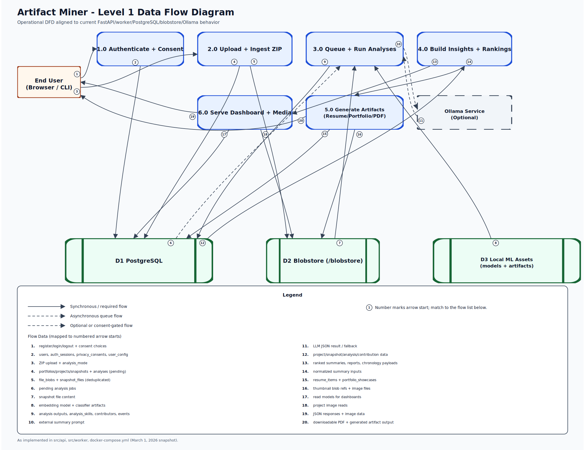

# Level 1 DFD Explanation

This Level 1 DFD reflects the current Artifact Miner implementation in `src/api`, `src/worker`, and PostgreSQL-backed storage.

The flow starts with the **End User** (browser or CLI), who authenticates, manages privacy consent, and uploads ZIP snapshots through the API. The upload path validates input, enforces `data_access` consent, persists portfolio/project/snapshot metadata to PostgreSQL, stores deduplicated file blobs in the blobstore, and queues analysis jobs in the `analyses` table.

The **worker poller** claims pending jobs and runs the parser, git metrics, local ML, and optional external LLM analysis paths. Analysis outputs, detected skills, contributor metrics, and derived events are written back to PostgreSQL. Optional external analysis is consent-gated via `external_services`; when not allowed or when external execution fails, the system falls back to local analysis behavior.

Downstream API processes build ranked summaries, chronology payloads, project reports, resume items, and portfolio showcase artifacts. Generated metadata is persisted in PostgreSQL, while image/PDF-related files are served from blob-backed paths. Final outputs are returned to the end user as JSON responses, media payloads, and downloadable artifacts.

