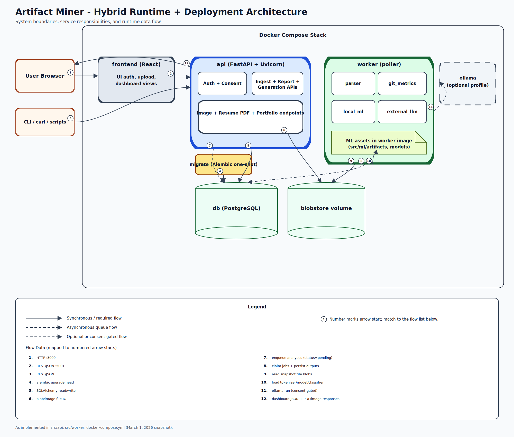

# System Architecture Design

The system is implemented as a hybrid runtime/deployment architecture centered on Docker Compose services and clear runtime boundaries.

The **client layer** includes the React frontend and CLI/curl consumers. The frontend communicates with the FastAPI backend over REST/JSON.

Inside the Compose stack, the **API service** handles auth, consent management, ZIP ingest, project reporting, ranking/chronology endpoints, image endpoints, and resume/portfolio generation endpoints. The API persists structured state in PostgreSQL and stores/retrieves binary project assets from the blobstore volume.

The **worker service** provides asynchronous processing by polling pending rows in the `analyses` table and executing parser, git metrics, local ML, and external LLM tasks. It reads snapshot content from blob-backed files, loads ML artifacts from the worker image (`src/ml/artifacts` and model files), and writes analysis outputs and derived records back to PostgreSQL.

The **migrate one-shot service** applies Alembic migrations before API/worker runtime startup. The **Ollama service** is optional (Compose profile), and external analysis paths are based on whether or not the user consents.

This architecture separates the request handling from background compute, while keeping storage concerns separate as well. PostgreSQL is used for relational state but blobstore for file and media content.

