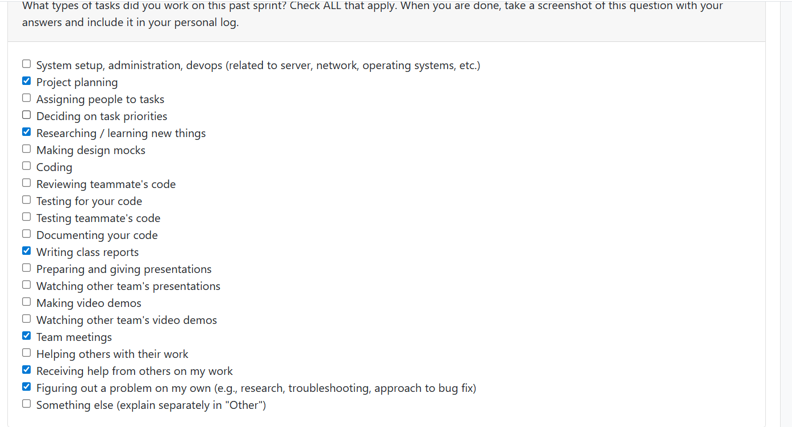
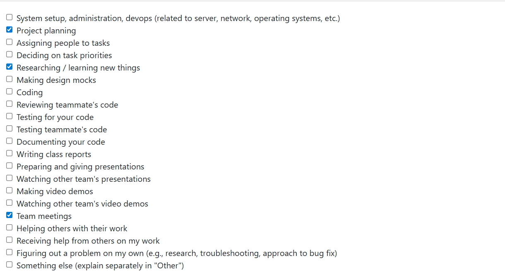

# Personal Log of Alex Batke

# Rerm 2 Week 2

## Applicable Date Range
- Monday, January 11th to Sunday, January 18th

## Peer Evaluation Screenshot

### Recap On Your Weeks Goals
- Which Features Were Yours in the Project Plan for this Milestone?
  In addition to all my previously completed work, I worked implementing the image thumbnail API endpoint this week so the user could choose an image
- Which Tasks from the Project Board are Associated with these Features?
   The relevant issue was #193, which  was the marker for that endpoint
- Among these tasks, which have you completed/in progress in the last 2 weeks?
 The endpoint is implemented, and passes tests, but is shaky, my lack of experiance and understanding of APIs and how they work was a real hinderance this week
- Planning for next sprint: 
  Next sprint will be focusing on learning more about APIs and how they work, and finding a possbly eaiser to undersand task for a better contribution.
- Optional text: additional context that we should be aware of:
  Nothing further to comment on. On to next week

# Week 14

## Applicable Date Range
- Monday, Monday December 1st to Sunday, December 7th

## Peer Evaluation Screenshot

### Recap On Your Weeks Goals
- Which Features Were Yours in the Project Plan for this Milestone?
  In addition to all my previously completed work, i was assigned this
  week to fine tune the PDF report, which included to sort the files that had prediected skills into a chronological order by modifed date, from last modified to first modified.
- Which Tasks from the Project Board are Associated with these Features?
   The relevant issues we #158 and #154, with 158 being a subissue to aid ensuring the modfied sorting was working on a base level before implementing on the more delicate PDF.
- Among these tasks, which have you completed/in progress in the last 2 weeks?
  The sorting now works as expected in the PDF, which can now allow the user to see the more recent files, showing more relevant skills being currently developed
- Planning for next sprint: 
  Next sprint will be in the New Year, and as such the Winter Break will allow us to prepare for the next Milesone.
- Optional text: additional context that we should be aware of:
  Nothing further to comment on. On to the next milestone

# Week 13

## Applicable Date Range
- Monday, November 24th to Sunday, November 30th

## Peer Evaluation Screenshot

### Recap On Your Weeks Goals
- Which Features Were Yours in the Project Plan for this Milestone?
  In addition to all my previously completed work, i was assigned this
  week to style the PDF that is exported so that the user has a more
  understandable document that they can interpret easier.
- Which Tasks from the Project Board are Associated with these Features?
  For the PDF Styling, the relevant issue is #92, which have sub issues #139 with just myself assigned. These sub issues are to break up the implementation for easier integration later on.
- Among these tasks, which have you completed/in progress in the last 2 weeks?
  The PDF styling was easily completed this week with little issue. The important part being what how exactly the team wants the document to look.
- Planning for next sprint: 
  Next sprint will focus on preparing and giving our Milestone #1 presentation and video demo, As well as iron out any bugs that have sprung up
- Optional text: additional context that we should be aware of:
  Nothing further to comment on. On to next week.

# Week 12 (Fixed to the correct Week)

## Applicable Date Range
- Monday, November 10th to Sunday, November 23rd

## Peer Evaluation Screenshot
was unable to access the peer evaluation and thus do not have a screenshot to show for this week, however, I did do the following:
  - Researching / Learning new things
  - Coding
  - Team Meetings
  - Figuring out a problem on my own
  - Testing for my code

### Recap On Your Weeks Goals
- Which Features Were Yours in the Project Plan for this Milestone?
  I was assigned to continue working on the exporter
- Which Tasks from the Project Board are Associated with these Features?
  The relevant issue is #92, which have sub issues #93 and#101 with just myself assigned. These sub issues are to break up the implementation for easier integration later on.
- Among these tasks, which have you completed/in progress in the last 2 weeks?
  Integration with the model was successful, but was inconsistent on my machine due to training constraints on the model due to limited memory
- Planning for next sprint: 
  Next sprint will focus on refining the integration and getting assistancw with ensuring it is consistent on more powerful machines
- Optional text: additional context that we should be aware of:
  I was struggling this week on getting the integration working due to the less powerful nature of my laptop not allowing for full training of our model. I believe the integration is in a working (non-breaking) state, but I am uncertain due to my own inconsistent results. It may be an issue further along in the project. Will have to monitor and possibly shift tasks if it poses problems again.

# Week 10

## Applicable Date Range
- Monday, November 3rd to Sunday, November 9th

## Peer Evaluation Screenshot

### Recap On Your Weeks Goals
- Which Features Were Yours in the Project Plan for this Milestone?
  I was assigned to start work the exporting our reports made by our model to pdf, one of the last unstarted pieces of the 1st milestone
- Which Tasks from the Project Board are Associated with these Features?
  The relevant issue is #92, which have sub issues #93 and #101 with just myself assigned. These sub issues are to break up the implementation for easier integration later on.
- Among these tasks, which have you completed/in progress in the last 2 weeks?
  The first part of the exporter was completed successfully this week by getting the basic functionality implemented and tested.
- Planning for next sprint: 
  Next sprint will focus on getting the functional exporter I implemented this week integrated with the rest of the project via the ML model already integrated.
- Optional text: additional context that we should be aware of:
  No further context to comment on. On to next week.

# Week 9

## Applicable Date Range
- Monday, October 27th to Sunday, November 2nd

## Peer Evaluation Screenshot

### Recap On Your Weeks Goals
- Which Features Were Yours in the Project Plan for this Milestone?
  My task for this week were to fix a small filepath issue with the input file unzipping, and then pass the unzipped input to the parser
- Which Tasks from the Project Board are Associated with these Features?
  The relevant issues are #65 and #66 (Unzipping of Input Files and Passing of Unzipped Files to Parser) with just myself assigned
- Among these tasks, which have you completed/in progress in the last 2 weeks?
  The unzipping of files was was successfully implemented and tested fully last week, the tests written previously still passed.  The passing of the files to the parser was completed successfully.
- Planning for next week: 
  The next task assigned to me will to start work on exporting of our analyzed results. This would be done using a pdf.
- Optional text: additional context that we should be aware of:
  Nothing else to report.

# Week 8

## Applicable Date Range
- Monday, October 20th to Sunday, October 26th

## Peer Evaluation Screenshot

### Recap On Your Weeks Goals
- Which Features Were Yours in the Project Plan for this Milestone?
  My task for this week was to implement input file unzipping in order for our parser to start analyzing the contents 
- Which Tasks from the Project Board are Associated with these Features?
  The relevant issues are #65 and #66 (Unzipping of Input Files and Passing of Unzipped Files to Parser) with just myself assigned
- Among these tasks, which have you completed/in progress in the last 2 weeks?
  The unzipping of files was was successfully implemented and tested fully, the tests written previously still passed. Passing the files to the parser will continue into next week.
- Optional text: additional context that we should be aware of:
  No issues to report. On to next week

# Week 7

## Applicable Date Range
- Monday, October 13th to Sunday, October 19th

## Peer Evaluation Screenshot

### Recap On Your Weeks Goals
- Which Features Were Yours in the Project Plan for this Milestone?
  My task for this week was refactoring the zip validator to put it its own module, and to add sys exits so the program ends more gracefully
- Which Tasks from the Project Board are Associated with these Features?
  The relevant issue is #51 (Refactor Zip Validation) with only myself assigned
- Among these tasks, which have you completed/in progress in the last 2 weeks?
  The ZIP Validation was successfully refactored and the tests written previously still passed
- Optional text: additional context that we should be aware of:
  No issues here. On to next week

## Week 6

## Applicable Date Range
- Monday, October 6th to Sunday, October 12th

## Peer Evaluation Screenshot

### Recap On Your Weeks Goals
- Which Features Were Yours in the Project Plan for this Milestone?
  I was assigned to a simple ZIP Validation to ensure when the user runs the system, it only analyzes a ZIP, not other file types 
- Which Tasks from the Project Board are Associated with these Features?
  The relevant issue is #32 (ZIP File Validation) with only myself assigned
- Among these tasks, which have you completed/in progress in the last 2 weeks?
  The ZIP Validation was successfully completed and tested during this week
- Optional text: additional context that we should be aware of:
  No issues to report. On to next week

## Week 5

## Applicable Date Range
- Monday, September 29th to Sunday, October 5th

## Peer Evaluation Screenshot

### Recap On Your Weeks Goals
- Which Features Were Yours in the Project Plan for this Milestone?
  I helped with the both Level 0 and 1 Data Flow diagrams and gave feedback where needed 
- Which Tasks from the Project Board are Associated with these Features?
  The relevant issue for the Data Flow Diagram (#14) were put on the Github Project board, with all group members being assigned to it
- Among these tasks, which have you completed/in progress in the last 2 weeks?
  The Data Flow Diagrams were the main tasks completed during this week
- Optional text: additional context that we should be aware of:
  No issues. On to next week!

## Week 4

### Applicable Date Range
- Monday, September 22nd to Sunday, September 28th

### Peer evaluation screenshot

### Recap On Your Weeks Goals
- Which Features Were Yours in the Project Plan for this Milestone?
  I gave feedback and suggestions on both our project proposal and our system architecture diagram, whcih were completed this week
- Which Tasks from the Project Board are Associated with these Features?
  The relevant issues were put on the Github Project board, with all group members being assigned to both
- Among these tasks, which have you completed/in progress in the last 2 weeks?
  As previously mentioned, both the system architecture diagram and project proposal was completed, along with each member setting up their local development environment 
- Optional text: additional context that we should be aware of:
  No issues at all at this point. On to next week!

## (Week 3)

### WHat went well 

- Inital discussion between team members about general project guidelines and requirements were effective. Tean consenus was reached on multiple different points
- making small, sensible refinements to our team's list of requirements after the inter-team discussion of the project requirements 

### WHat didn't go well
- requirements from some teams were not measurable, making it difficult to understamd their thought process and what they deemed neccessary
- other requirements from some teams were also non specific (eg. the system should search the user's folder structure)

### Planning for the next cycle
- Deciding roles for team members
- Start more specific, in depth planning for the project
- fine tune requirements as necessary as planning continues

### Peer Evaluation screenshot
