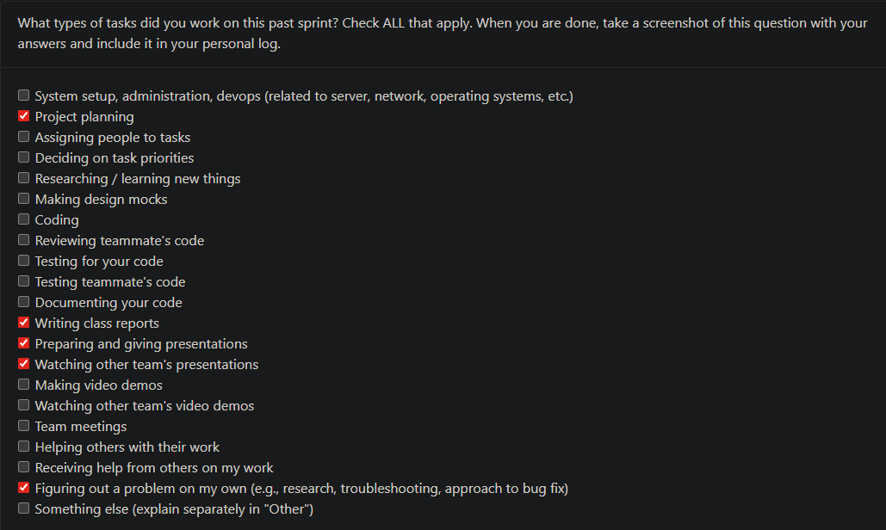
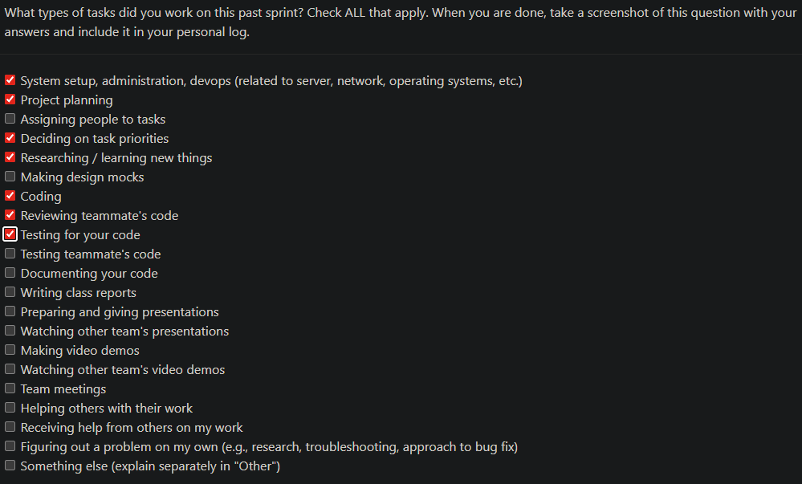

# Personal Log of Cole Powrie — Week 1 Term 2 (BONUS)

**Applicable Date Range:**  
**Monday, December 7th to Sunday, January 12th**

### Peer Evaluation Screenshot

## This Milestone
- Focused on **database integration troubleshooting**, resolving critical issues that prevented skills analysis results from being stored in PostgreSQL.
- Fixed **JSON serialization errors** that were breaking the entire storage pipeline.
- Implemented **automated database setup**, simplifying configuration for team members.
- Created **testing procedures** to verify the full pipeline works end-to-end.

## Tasks
- **Fixed Database Connection Issues:**
  - Updated `connect.py` with retry logic for Docker (`db` host) and local (`localhost`) connections.
  - Resolved password mismatches between Docker Compose and database connection code.
  - Added connection timeout handling and retry mechanisms.

- **Solved JSON Serialization Errors:**
  - Fixed `Object of type ZipInfo is not JSON serializable` error.
  - Created `make_metadata_serializable()` helper function for proper data conversion.
  - Ensured all metadata stored in PostgreSQL is JSON-serializable.

- **Implemented Database Integration:**
  - Created `skills_integration.py` to bridge ML / Ollama analysis with PostgreSQL.
  - Added functions to store both ML and LLM analysis results.
  - Implemented skill extraction logic for the `detailed_skills` table.

- **Simplified Database Schema:**
  - Removed unused tables (`users`, `category`, `artifacts`).
  - Retained only essential tables: `skills_analysis` and `detailed_skills`.
  - Updated `create_tables.py` for minimal and idempotent schema setup.

- **Improved Code Structure:**
  - Fixed import paths in `main.py` to work correctly from the `src/` directory.
  - Added debug logging for easier troubleshooting.
  - Created pull request documentation for team integration.

## Progress Over the Last Two Weeks
- Restored full database functionality — skills analysis now properly persists in PostgreSQL.
- Verified the complete pipeline: ZIP → ML analysis → Database → PDF report.
- Tested multiple configurations, confirming functionality in both Docker and local development environments.
- Created clear team setup instructions using a simple four-command workflow.
- Documented all changes thoroughly in a detailed pull request.

## In-Progress Tasks
- Final testing on team member machines.
- Documentation updates for new setup and troubleshooting procedures.
- Monitoring for edge cases during production use.

## Next Cycle Activities
- Performance optimization of database queries.
- Implementing data export functionality.

# Personal Log of Cole Powrie — Week 14

**Applicable Date Range:**  
**Monday, December 1st to Sunday, December 7th**

### Peer Evaluation Screenshot

## This Milestone
- Focused on **presentation preparation** and **final report work** as groups began presenting their capstone progress.
- Cleaned up and clarified parts of the **backend/database explanation** for the presentation.
- Watched other groups present to understand expectations, pacing, and common feedback themes.

## Tasks
- Created **slides** for the backend + database portion of the presentation.
- Reviewed and edited sections of the **capstone report**, especially technical backend/database portions.

## Progress Over the Last Two Weeks
- Verified backend + PostgreSQL containers running properly on multiple devices.
- Cleaned up Git branches after merge conflicts and fixed divergence between `develop`, `develop2`, and local branches.
- Ensured the codebase is fully recoverable and buildable using Docker Compose.
- Observed peer presentations

## In-Progress Tasks
- Troubleshooting and finalizing backend and pipelining

## Next Cycle Activities
- Finalizations and any bug fixing
- Plan improvements for the next term’s implementation phase.
  
# Personal Log of Cole Powrie — Week 13

**Applicable Date Range:**  
**Monday, November 24th to Sunday, November 30th**

### Peer Evaluation Screenshot

## This Milestone
- Successfully configured Docker Compose environment with Python and PostgreSQL containers.  
- Connected backend to PostgreSQL container and verified proper database initialization.  
- Developed and tested `create_tables.py` to set up `users`, `category`, `llm_results`, and `artifacts` tables (`artifacts` includes JSONB metadata).  
- Implemented LLM persistence pipeline: permission check, local analyzer fallback, JSON parsing, and DB mapping.  
- Integrated persistence into main workflow to persist per-file analysis results.  
- **Note:** No changes have yet been merged into `main` — work remains on feature branches while in progress.

## Tasks
- Updated `docker-compose.yml` and `Dockerfile` to ensure app ↔ database communication and required system packages (`libmagic`, `libpq`).  
- Centralized DB connection in `connect.py` to read environment variables.  
- Added `llm_mapper.py` to persist raw LLM output, upsert categories, and insert artifacts with metadata.  
- Updated `LLM_permission.py` to call mapper and handle JSON or raw outputs.  
- Modified `main.py` to call `process_data_with_permission()` for each parsed file and persist results.  
- Created `manual_llm_map_test.py` to test persistence without ML artifacts.  
- Resolved container import / PYTHONPATH issues for in-container testing.

## Progress Over the Last Two Weeks
- Fully containerized backend and DB for consistent development and testing.  
- Ensured reproducible DB initialization and verified persisted rows (`llm_results`, `category`, `artifacts`).  
- Improved Git workflow and branch management; recovered and consolidated working branches.

## In-Progress Tasks
- Testing CRUD operations and relationship integrity for the new schema.  
- Validating persistence under different inputs and error conditions.  
- Preparing for ML pipeline integration (accepting encoder/model artifacts from ML team).  
- Adding unit/integration tests around persistence and pipeline functions.

## Next Cycle Activities
- Integrate ML classifier artifacts (encoder, model) and ensure classifier outputs flow into metadata.  
- Implement a lightweight read-only API (FastAPI/Flask) to expose `artifacts` and `llm_results`.  
- Add CI (GitHub Actions) for linting, unit tests, and integration tests against a test DB.  
- Introduce migrations (Alembic) and add JSONB indexes for metadata queries.  
- Merge tested feature branches into `main` once CI/tests are established.

# Personal log of Cole Powrie (Week 12)  

## Applicable Date Range
- Monday, November 17th to Sunday, November 23rd

## Peer evaluation screenshot

## This Milestone
- Successfully configured **Docker Compose** environment with Python and PostgreSQL containers
- Connected backend to PostgreSQL container and verified proper database initialization
- Developed and tested `create_tables.py` script to set up tables and insert default data
- Resolved local and remote branch conflicts, ensuring working code is synced across devices

## Tasks
- Updated `docker-compose.yml` and Dockerfile for proper backend-container to database communication
- Verified credentials, hostnames, and ports for containerized PostgreSQL access
- Ran `create_tables.py` in Docker to successfully create `users`, `category`, and `artifacts` tables with default data
- Resolved Git branch issues and pushed restored working branch to GitHub

## Progress from the Last Two Weeks
- Fully containerized backend and database environment for consistent development across devices
- Ensured working Docker workflow for initializing and testing database tables
- Improved Git workflow and branch management to avoid conflicts with old branches

## In Progress Tasks
- Testing CRUD operations in the backend with the new database schema
- Validating data persistence and relationships within containerized environment
- Preparing environment for ML pipeline integration with backend and database

## Next Cycle Activities
- Connect backend API endpoints to the updated schema
- Continue integration testing with ML pipeline and frontend components
- Expand automated tests for database operations within Docker containers
- Refine Docker and Git workflows for smooth multi-device development
# Personal log of Cole Powrie (from Week 10)
## Applicable Date Range
- Monday, November 3rd to Sunday, November 9th

## Peer evaluation screenshot

## This Milestone
- Improved database schema with better **cascading rules** and **unique constraints**
- Updated table structures to ensure referential integrity and automatic handling of record updates/deletions  
- Started work on verifying the successful setup and execution of the schema using **Docker Compose** with PostgreSQL and Python containers  

## Tasks
- Modified and tested schema setup scripts to include:  
  - `ON DELETE CASCADE` and `ON UPDATE CASCADE` relationships  
  - `UNIQUE` constraints to prevent duplicate entries  
- Verified successful database initialization and connection within the Docker environment  

## Progress from the Last Two Weeks
- Fixed/still working on setup issues with Docker and PostgreSQL integration  
- Enhanced data reliability through refined constraint and timestamp implementation  

## In Progress Tasks
- Testing backend CRUD operations under new cascading and constraint logic  
- Validating data persistence and behaviour on updates and deletions  

## Next Cycle Activities
- Connect backend endpoints to the updated schema  
- Integrate backend database operations with the ML pipeline and frontend  
- Continue expanding relationships and improving schema performance and maintainability  

# Personal log of Cole Powrie (from Week 9)
## Applicable Date Range
- Monday, October 27th to Sunday, November 2nd

## Peer evaluation screenshot

## This Milestone
- Implemented proper database schema for our PostgreSQL setup  
- Added Users, Artifacts, and Category tables to structure our backend data  
- Established foreign key relationships between tables to link users, artifacts, and categories  
- Inserted 10 default general categories into the `category` table upon creation (subject to change as we identify our categories)

## Tasks
- Updated database initialization script (`setup_test_db.py`) to include:  
  - Creation of the `users`, `artifacts`, and `category` tables  
  - Establishment of a foreign key relationship between `artifacts.user_id` → `users.id`  
  - Addition of a foreign key between `artifacts.category_id` → `category.id`  
  - Automatic population of 10 general categories when the table is first created  

## Progress from the last two weeks
- Successfully connected to PostgreSQL via Python using `psycopg2`  
- Confirmed working connection through test table creation and queries  
- Transitioned from test tables to the start of relational structure for our project  

## In Progress Tasks
- Populating the tables with real project data (users, file uploads, etc.)  
- Integrating database interactions into our backend endpoints  

## Next Cycle Activities
- Expand the category system and artifact handling to support ML integration for file analysis
- Adding more relevant tables and furthering the relationships between them

# Personal log of Cole Powrie (from Week 8)
## Applicable Date Range
- Monday, October 20th to Sunday, October 26th

## Peer evaluation screenshot

## This Milestone
- We continued work on our zip and file validator
- Researched and found a dataset to pre-train our ML model
- Started setting up our PostgreSQL and the connection to it

## Tasks
- Researching and identifying different datasets and methods of pre-training for our ML model
- Setting up a basic connection file to PostgreSQL, as well as implementing a test table to ensure proper connection

## Progress from the last two weeks
- We have made extensive progress on the training of our ML model
- Started a basic implementation of DB and the connection to it

## In Progress Tasks
- Adding values to our tables in our database and further setting up the DB

## Next Cycle Activities
- We will next continue on our backend code for our file handling
- Continue the integration and implementation of our DB

# Personal log of Cole Powrie (from Week 7)
## Applicable Date Range
- Monday, October 13th to Sunday, October 19th

## Peer evaluation screenshot

## This Milestone
- Started work on our coding parser and our zip file validator
- Updated our ReadMe with our DFD level 1 and our system architecture design

## Tasks
- Start coding work on our backend for our file handling
- Update our ReadMe with our system information and DFD

## Progress from the last two weeks
- Our coding environment has been set up, and functional requirements are being worked on

## In Progress Tasks
- The backend code for our file processing and handling
- The start of our code for the parser

## Next Cycle Activities
- We will next continue on our backend code for our file handling

# Personal log of Cole Powrie (from Week 6)
## Applicable Date Range
- Monday, October 6th to Sunday, October 12th

## Peer evaluation screenshot

## This Milestone
- Finalized our DFDs
- Start setting up our coding environment
- Added pull request template

## Tasks
- Finalized and clarified our DFD using Figma
- Created a wireframe of how we expect the flow of our program to work to help with our backend organization

## Progress from the last two weeks
- Finalized our DFD, started our code and its enviroment, and made a wireframe

  
# Personal log of Cole Powrie (from Week 5)
## Applicable Date Range
- Monday, September 29th to Sunday, October 5th

## Peer evaluation screenshot

## This Milestone
- We made our data flow diagram for our project
- We created our level 0 and level 1 data flow diagram and finalized our level 1 diagram

## Tasks
- Helped review for our DFD's

## Progress from the last two weeks
- From the last two weeks I helped with our DFD as well as create and organize our system architecture diagram with Figma
  
# Personal log of Cole Powrie (from Week 4)
## Applicable Date Range
- Monday, September 22nd to Sunday, September 28th

## Peer evaluation screenshot

## Recap On Your Weeks Goals
- Which Features Were Yours in the Project Plan for this Milestone?
  I helped with front end aspect for our project proposal as well as the system architecture diagram, which we did through .Fimga
- Which Tasks from the Project Board are Associtaed with these Features?
  We recorded these tasks as issues in our GitHub repository and made sure that we divided tasks evenly for the proposal and system architecture diagram.
- Among these tasks, which have you completed/in progress in the last 2 weeks?
  We completed our project proposal and system architecture diagram this week.
- Optional text: additional context that we should be aware of:
  Good communication and effort from everyone in the team!
  

# Personal log of Cole Powrie (from Week 3)

## What went well

- Discussion with other teams was insightful to see other peoples interpretations of the project outline
- Our discussion went smooth and everyone was on the same page for what we wanted our functional and non-functional requirements.

## What didn’t go well

- Difficulty and confusion in finding and talking with the other teams about their requirements

## Planning for the next cycle

- Completing our Project Proposal
- Completing our system architecture diagram

