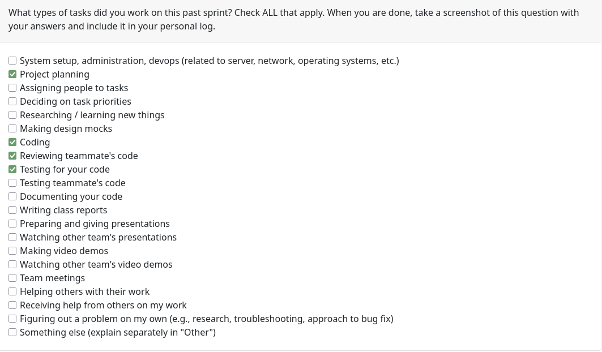
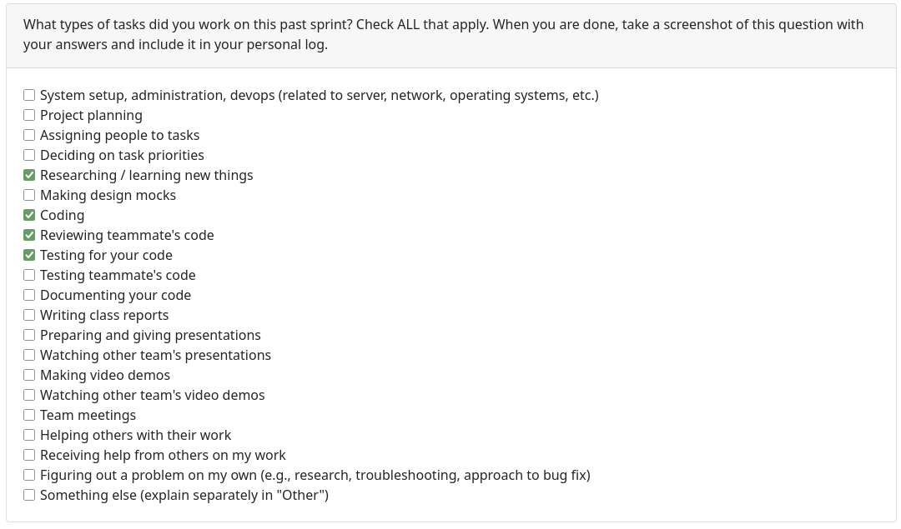
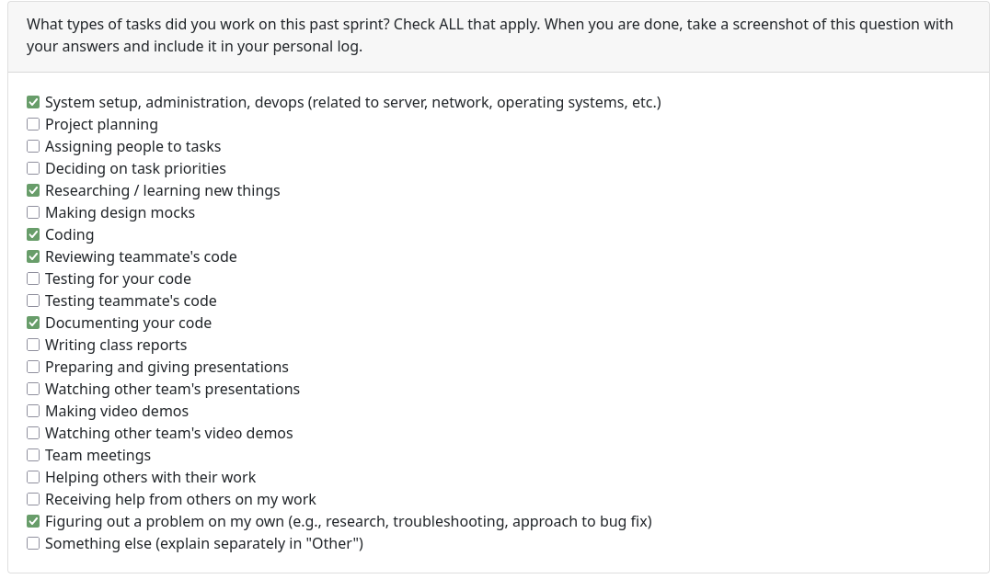
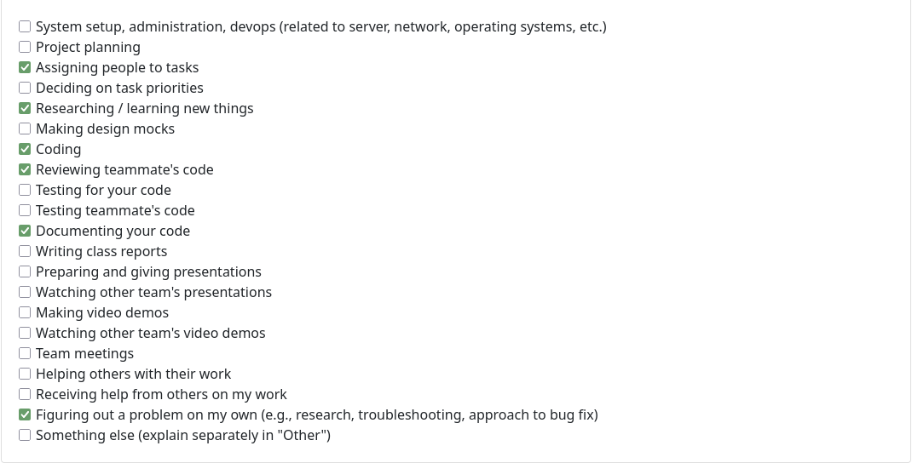
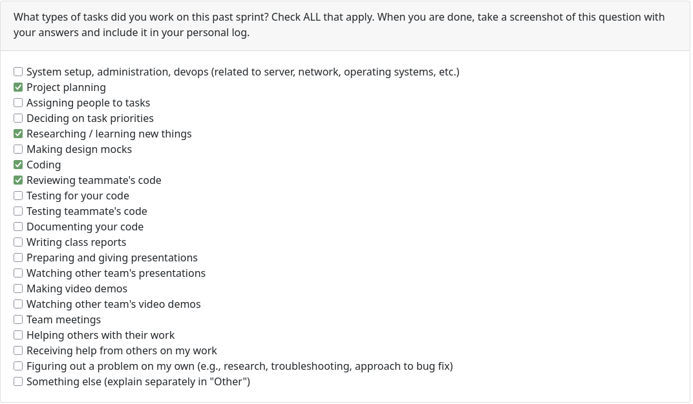
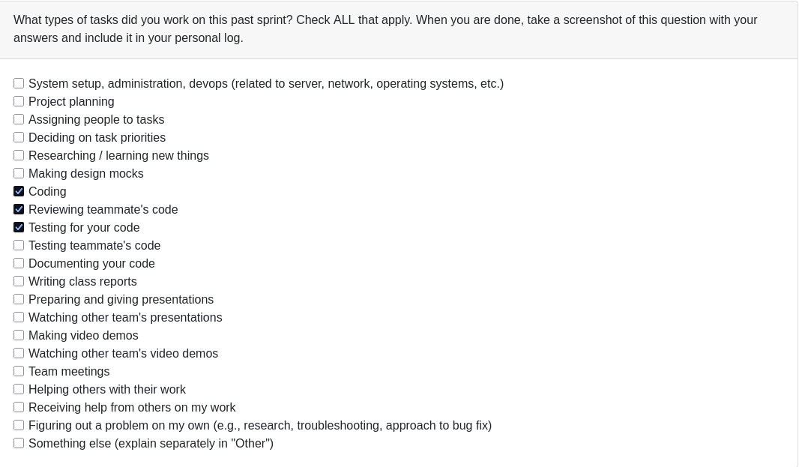

# Personal log of Liam Storgaard 

## Week 3

### What went well

- Team seems to work well together so far.
- We got some perspective on the merits of a desktop vs. web based app for the project

### What didn’t go well

- Requirements from other teams were basically identical to our own so not much was learned beyond what was stated above.

### Planning for the next cycle

- Further refine the planned structure of our app
- Decide who will be doing what on the project more concretely.
- Refine requirements as needed.

## Week 4

### What went well

- We were able to sort out both the issue with our team number and the issue with the logs/docs branch effectively and communicated well.
- Seeing other groups system design architectures gave us more ideas for our frontend/backend integration.

### What didn’t go well

- We needed more time to create a full system architecture diagram and only had a simplified one by Wednesday's class since we needed to do more research on the ML aspect of the backend.

### Planning for the next cycle

- Prepare to assign roles to people based on their skills
- Begin discussing the technical details of the ML processing (which python framework, model, etc. to use).
- Come up with a plan for which tasks to complete first when we eventually do begin programming.

## Week 5
- Applicable date range
September 29 - October 5.
- Type of tasks you worked on (screenshot from Peer Eval question)

- Recap on your week's goals
Complete both DFD levels and refine as needed based on feedback from other groups.
- Which features were yours in the project plan for this milestone?
I did the review for both the DFD diagrams.
- Among these tasks, which have you completed/in progress in the last 2 weeks?
I completed the fixes we needed for both DFDs since some of the icons were incorrect. I also readjusted it to be more accurate to our system layout. 

## Week 6
- Applicable date range
October 6 - 11
- Type of tasks you worked on (screenshot from Peer Eval question)

- Recap on your week's goals
We got a start on the parsing and other baseline mechanics, as well as laying out the file structure, which was in line with our goals.
- Which features were yours in the project plan for this milestone?
I worked on the file parser mechanics, specifically the logic for detecting and ignoring binary files.
- Which tasks from the project board are associated with these features?
Binary/Human Readable distinction, issue #19
- Among these tasks, which have you completed/in progress in the last 2 weeks?
I completed the MIME based file detector, which achieved that part of that task. I also created relevant test files for that function to ensure it worked properly.

## Week 7
- Applicable date range
October 13 - 19
- Type of tasks you worked on (screenshot from Peer Eval question)

- Recap on your week's goals
We needed to continue adding the baseline I/O and file parsing so that we have a foundation for passing the input to the ML model later on.
- Which features were yours in the project plan for this milestone?
Adding file chunking from the parsed directories.
- Which tasks from the project board are associated with these features?
Text chunking for future ML model use, issue #35
- Among these tasks, which have you completed/in progress in the last 2 weeks?
I completed the above task/issue. There is now a functioning parser which iterates through directories, ignores binary files and directories like .git, and outputs ~2000 word JSONL chunks with some basic language metadata.

## Week 8
- Applicable date range
October 20 - 26
- Type of tasks you worked on (screenshot from Peer Eval question)

- Recap on your week's goals
We wanted to get our ML model choice concretely solidified and begin integrating it into our project.
- Which features were yours in the project plan for this milestone?
Adding and integrating the ML model.
- Which tasks from the project board are associated with these features?
HiGitClass integration, #56
- Among these tasks, which have you completed/in progress in the last 2 weeks?
I completed the task successfully. I used an ML model based on the academic paper "HiGitClass" originally intended for easy keyword classification of GitHub projects. We can easily adapt this to our use case, and I integrated it into our project as a submodule, and created scripts to easily set it up and install the dependencies.

## Week 9
- Applicable date range
October 27 - November 2
- Type of tasks you worked on (screenshot from Peer Eval question)

- Recap on your week's goals
We wanted to wire up the file I/O stuff to the ML model. We also needed to investigate an alternative to HiGitClass that would work with arbitrary code rather than just Git repos.
- Which features were yours in the project plan for this milestone?
The ML classification model (using PyTorch and the-stack for training)
- Which tasks from the project board are associated with these features?
Universal ML Classification Model #72
- Among these tasks, which have you completed/in progress in the last 2 weeks?
That one I completed this week. The model is set up and was tested and it works great (testing against our own code, it correctly classifies our Docker code under the "containerization" skillset). In the coming weeks I will add more training data and refine the categories since the current ones are just random ones for testing.

## Week 10
- Applicable date range
November 3 - November 9
- Type of tasks you worked on (screenshot from Peer Eval question)

- Recap on your week's goals
Keep fine tuning the ML model and link up all the individual parts so we can have a full pipeline.
- Which features were yours in the project plan for this milestone?
Improving the categories for the ML model.
- Which tasks from the project board are associated with these features?
Retrain ML model with new categories #89 
- Among these tasks, which have you completed/in progress in the last 2 weeks?
I completed the above task, the ML model now has 54 categories which are more language agnostic and comprehensive.

## Week 11
- Applicable date range
November 17 - November 23
- Type of tasks you worked on (screenshot from Peer Eval question)

- Recap on your week's goals
Connect all the independent parts of the project into a CLI interface.
- Which features were yours in the project plan for this milestone?
The CLI interface.
- Which tasks from the project board are associated with these features?
Command Pipeline #108
- Among these tasks, which have you completed/in progress in the last 2 weeks?
The above one. There is now a complete end to end command that takes in any zip folder and returns classification results.

## Week 13
- Applicable date range
November 23 - November 30
- Type of tasks you worked on (screenshot from Peer Eval question)

- Recap on your week's goals
Keep connecting everything else into a pipeline and get ready for the milestone presentation.
- Which features were yours in the project plan for this milestone?
A fix and improvement for the LLM/ML pipeline.
- Which tasks from the project board are associated with these features?
#128 Allow stacking of ML model + LLM and properly handle consent refusal
- Among these tasks, which have you completed/in progress in the last 2 weeks?
That one, it now properly falls back to the locally trained ML model on consent refusal and allows stacking the two models if given.
