# Weekly Navigation (Term 2)
- [Term 2 Weeks 6 & 7 + Reading Week](#term-2-weeks-6--7--reading-week--february-9--march-1-2026)

# Will Tilden Personal Logs  //  Term 2 Weeks 6 & 7 + Reading Week – February 9 – March 1, 2026

### Connection to Previous Week
- Last sprint I focused heavily on expanding test coverage across the app, bringing app.py from 74% to 86% coverage and adding tests to previously untested codeparser modules. This sprint I returned to the planned feature work I had deferred — specifically the portfolio showcase and resume wording edit UI features — and also picked up several bug fixes and infrastructure improvements that came up as the team pushed toward the Milestone 2 deadline.

---

### Coding Tasks

- **PR #252 — GET /projects/{project_id} now returns evidence**: Fixed a data asymmetry bug where project evidence (metrics, feedback, etc.) was being persisted via PATCH but not returned in the GET response. Updated the SQL query to include the `evidence_json` column, mapped it to a clean `evidence` key in the API response with a null-safety fallback, and added an end-to-end integration test to verify the write-and-read round trip. Credit to Liam for finding this.
  - PR: <https://github.com/COSC-499-W2025/capstone-project-team-15/pull/252>

- **PR #253 — Thumbnail association fix**: Fixed a 500 error on project image uploads by enforcing a strict 1:1 relationship between projects and portfolio showcases. Changes included adding `unique=True` to project_id in base.py to block duplicates at the DB level, switching generation.py to an upsert pattern, cleaning up the image upload lookup in app.py, ensuring AI text updates no longer wipe manually uploaded thumbnails, adding a migration file, and adding a pytest test verifying the new upsert logic.
  - PR: <https://github.com/COSC-499-W2025/capstone-project-team-15/pull/253>

- **PR #268 — Resume wording edit UI**: Added the ability for users to edit resume content (summary and bullet points) after generation with edits persisted to the DB and reflected in the downloaded PDF. Previously the Generate button would immediately download a PDF with no way to edit. Changes include a new `GET /projects/{project_id}/latest-resume` endpoint, pre-population of the editing UI on project load, a new Resume Editing section in the project detail view, Save and Download buttons, and two new api.js methods (`getLatestResume`, `updateResumeItems`).
  - PR: <https://github.com/COSC-499-W2025/capstone-project-team-15/pull/268>

- **PR #274 — Portfolio Showcase Wording Edit in UI**: Completed the portfolio showcase text customization flow in the frontend. Users can now view generated portfolio showcase text for each project, edit the title and summary wording in-app, and save their changes through the existing portfolio edit endpoint. This was the main Milestone 2 feature I had planned for this sprint.
  - PR: <https://github.com/COSC-499-W2025/capstone-project-team-15/pull/274>

- **PR #275 — Milestone 2 Test ZIP Files**: Created and committed three zipped test data files to satisfy the Milestone 2 test data requirements: `snapshot_early.zip` and `snapshot_late.zip` (the same Task Manager project at two different points in time with real git history), and `multi_project.zip` (three subdirectory projects covering individual code, collaborative code, and individual text/doc project types, each with their own git history).
  - PR: <https://github.com/COSC-499-W2025/capstone-project-team-15/pull/275>

- **PR #277 — GET /portfolio/{portfolio_id} returns text**: Updated the `GET /portfolio/{portfolio_id}` endpoint to include showcase text content in its response, fulfilling M2 requirement #29 (Display textual information about a project as a portfolio showcase). Previously the endpoint only returned metadata (id, user_id, name, created_at). Now it also calls list_portfolio_showcases and attaches the items array to the response. Added two new tests covering the populated and empty states.
  - PR: <https://github.com/COSC-499-W2025/capstone-project-team-15/pull/277>

---

### Testing & Debugging Tasks
- Tested and debugged my own PRs (#252, #253, #268, #274, #275, #277) both manually and via the pytest suite before submitting.
- Reviewed and tested teammate PRs (see below) — tested both manually and with pytest where applicable.
- Helped teammates debug various errors that came up across PRs during the sprint, including merge conflict resolution and test database setup issues. The team was highly collegial in working through these together.

---

### Reviewing & Collaboration Tasks
- Reviewed PR #245 — Authentication backend for React **(first reviewer)**: Backend auth foundation adding auth_accounts/auth_sessions tables, register/login/logout/me endpoints, password hashing, session token issuance, and scoped project/portfolio access.
  - <https://github.com/COSC-499-W2025/capstone-project-team-15/pull/245>
- Reviewed PR #246 — Authentication user interface **(first reviewer)**: Frontend auth layer adding login/register forms, session restore, logout, and switching the frontend API client to bearer-authenticated requests.
  - <https://github.com/COSC-499-W2025/capstone-project-team-15/pull/246>
- Reviewed PR #247 — User-facing project insight views **(second reviewer)**: Expanded dashboard with project detail/report display, contributor list, detected skills, portfolio top-project ranking, skills timeline, and resume generation trigger.
  - <https://github.com/COSC-499-W2025/capstone-project-team-15/pull/247>
- Reviewed PR #248 — UI Styling **(second reviewer)**: Full visual design pass across auth and dashboard views. This PR was ultimately closed without merging, but the review work was still valuable — the feedback I provided directly informed the final styling approach that made it into the codebase through the subsequent styling PRs.
  - <https://github.com/COSC-499-W2025/capstone-project-team-15/pull/248>
- Reviewed PR #269 — Initial UI Styling PR 2.5 - Auth and Dashboard Styling **(first reviewer)**: Styles for the Auth and Dashboard components, split out from the monolithic Homepage.jsx.
  - <https://github.com/COSC-499-W2025/capstone-project-team-15/pull/269>
- Reviewed PR #271 — Resume PDF expansion + generation enrichment + regression fixes **(second reviewer)**: Hybrid bullet generation, enriched resume content, expanded PDF sections, filter normalization, and regression fixes.
  - <https://github.com/COSC-499-W2025/capstone-project-team-15/pull/271>
- Reviewed PR #273 — Structured logging + print cleanup **(first reviewer)**: Proper structured logging across API and worker flows, removing ad-hoc print-style logs.
  - <https://github.com/COSC-499-W2025/capstone-project-team-15/pull/273>

---

### Issues or Blockers
- No major blockers this sprint. There were occasional errors across various PRs (merge conflicts from old branches, test database issues, minor regressions) but these were resolved quickly through good team communication and collaboration. The team was highly collegial in debugging these together and we've committed to faster turnaround on change requests going forward to avoid them piling up.

---

### Plan for Next Week
- Add frontend end-to-end testing throughout the app.
- Expand and improve the resume output to make it more professional and polished.
- Search for bugs and missing functionality across the app and address anything found.

---

### Peer Evaluation Term 2 Weeks 6 & 7 + Reading Week
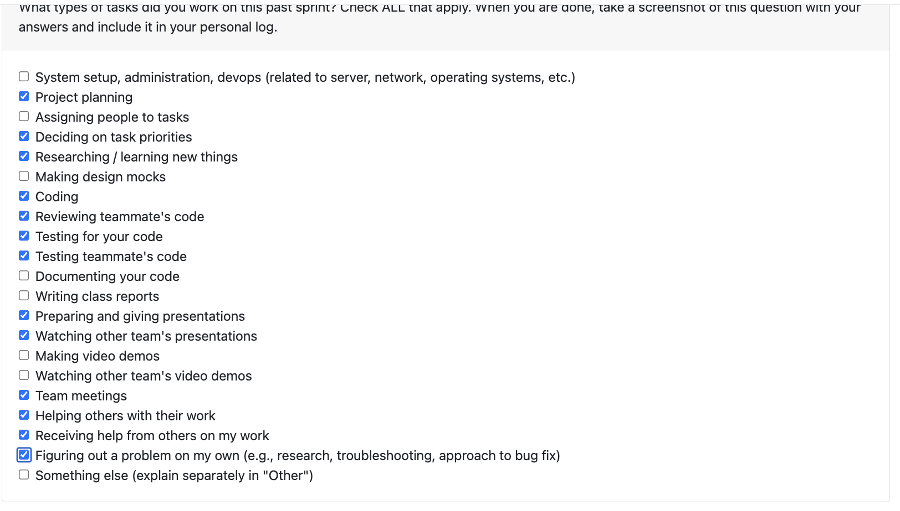

---

## Will Tilden Personal Logs  //  Term 2 Week 5 – January 26 – February 8, 2026

### Connection to Previous Week
- Last week I made a big contribtuion on adding the ability for the user to customize which parts of the resume would and wouldn't render, this week I worked on different tasks that aren't really related. New issues.

---

### Coding Tasks

- completed features numbers 32.4 and 32.5, adding two new endpoints to the API along with assoicated tests.
  - Issue: <https://github.com/COSC-499-W2025/capstone-project-team-15/issues/224>
  - PR: <https://github.com/COSC-499-W2025/capstone-project-team-15/pull/225>
- vastly improved the testing suite of the program by perforiming testing coverage and identifying areas that needed improved coverage, focusing strongly on our main api file app.py, which had just 74% test coverage with some large sections not covered. Made one PR adding 13 new tests to increase that file's coverage from 74% to 86%, and then second PR focusing on the codeparser module where the fileclassification.py and chunking.py files had no tests at all, and brought them up to near perfect coverage with the addition of about 7 new tests.
  - app.py test addition:
      - Issue: <https://github.com/COSC-499-W2025/capstone-project-team-15/issues/222>
      - PR: <https://github.com/COSC-499-W2025/capstone-project-team-15/pull/223>
  - codeparser test addition:
      - Issue: <https://github.com/COSC-499-W2025/capstone-project-team-15/issues/228>
      - PR: <https://github.com/COSC-499-W2025/capstone-project-team-15/pull/229>

---

### Testing & Debugging Tasks
- As mentioned, I massively improved the testing coverage of the app across multiple files and modules with the addition of ~20 tests
- I also tested my own contribtuion of the new endpoints both manually and using the pytest tests
- I also tested Liam's PRs both manually and using the pytest suite:
  - <https://github.com/COSC-499-W2025/capstone-project-team-15/pull/223>
  - <https://github.com/COSC-499-W2025/capstone-project-team-15/pull/218>
- And I tested Alex's PR manually:
  - <https://github.com/COSC-499-W2025/capstone-project-team-15/pull/231>

---

### Reviewing & Collaboration Tasks
- I reviewed two of Liam's PRs and one of Alex's PRs
  - <https://github.com/COSC-499-W2025/capstone-project-team-15/pull/223>
  - <https://github.com/COSC-499-W2025/capstone-project-team-15/pull/218>
  - <https://github.com/COSC-499-W2025/capstone-project-team-15/pull/231>
- Spent about 2 hours on call with Alex helping him troubleshoot terminal error in setting up his test database, it was a fun example of some highly collegial work and successfully error fixing that led to a successful fix and him being able to run tests once again

---

### Issues or Blockers
- No blockers or issues to report from this week.
- Myself and the team are feeling confident as the milestone 2 deadline approaches as we have very few features left to tick off and are already getting a headstart on our front end 

---

### Plan for Next Week
- As my plans for these weeks changed and I ended up not doing the things I had planned to do but instead still found lots of work to do, for next week I will be coming back to what I planned to do this week which is the following:
  
    - #29: Display textual information about a project as a portfolio showcase
    - #30: Display textual information about a project as a résumé item

- I suspect these can be batched together a bit more easily than other features as they all involved the addition of textual information to the resume so they might even make sense to batch together

---

### Peer evaluation Term 2 Week 5
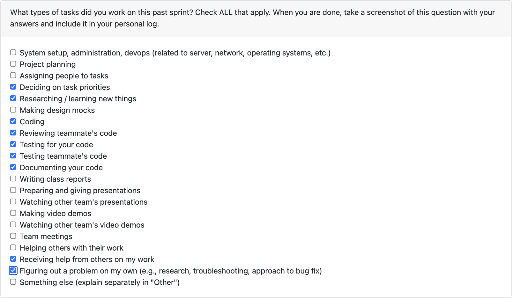

---

## Will Tilden Personal Logs  //  Term 2 Week 3 – January 19–25, 2026

### Connection to Previous Week
- Last week I worked on a somewhat similar task from the milestone requirements where I added the ability for the user to specifiy the name of their project as they want it to appear on their resume
- This week was a somewhat similar feature, another requirement from the milestone 2 list, where I allow users the ability to toggle on and off what sections do and don't show on the resume
- The two changes involved similar processes which is why I was glad to do one after the other, as they were similar in the nature of how to set them up and get them working

---

### Coding Tasks
- Completed feature number 23 under milestone 2: Allow users to choose which information is represented -> issue number 197
- Fixed bug where a test was failing on some operating systems and passing on others -> issue number 199
- Successfully started, completed, and merged the feature and the bug fix within this week.
- Submitted and merged PR of feature 23 (#198): (https://github.com/COSC-499-W2025/capstone-project-team-15/pull/198)
- Submitted and merged PR of bug (#199): (https://github.com/COSC-499-W2025/capstone-project-team-15/pull/202)
---

### Testing & Debugging Tasks
- Performed manual testing and ran test cases on my own PR (#198). https://github.com/COSC-499-W2025/capstone-project-team-15/pull/198
- Conducted testing and review of Luis's PR (#203). https://github.com/COSC-499-W2025/capstone-project-team-15/pull/203
- Performed manual testing and ran test cases for Alex's PR (#194) https://github.com/COSC-499-W2025/capstone-project-team-15/pull/194
- Performed manual testing and ran tests cases on my PR of the bugfix that I did (#202) https://github.com/COSC-499-W2025/capstone-project-team-15/pull/202

---

### Reviewing & Collaboration Tasks
- Reviewed Luis's PR (#203): <https://github.com/COSC-499-W2025/capstone-project-team-15/pull/203>
- Maintained high collegiality with the team throughout the week.
- I was the first to review Alex's PR (#194): <https://github.com/COSC-499-W2025/capstone-project-team-15/pull/194>
  - ^note that the above PR may not have gotten merged this week but I did still review it first and provided meaningful feedback

---

### Issues or Blockers
- No blockers or issues to report from this week.
- Myself and the team are feeling confident going into peer testing this week

---

### Plan for Next Week
- For next week I am looking at making a larger contribution and am looking at a few different requirements from the milestone 2 list and am considering doing 2 or possibly all three of them:
  
    - #27:Customize and save information about a portfolio showcase project
    - #29: Display textual information about a project as a portfolio showcase
    - #30: Display textual information about a project as a résumé item

- I suspect these can be batched together a bit more easily than other features as they all involved the addition of textual information to the resume so they might even make sense to batch together

---

### Peer evaluation Term 2 Week 3

---

## Will Tilden Personal Logs  //  Term 2 Week 2 – January 12–18, 2026

### Connection to Previous Week
- Nothing to connect to from last week.
- Great week overall; everyone made big contributions and the group worked well together.
- A big refactoring was completed by Liam (kudos to Liam) to get the team on track for the API requirements of milestone 2.

---

### Coding Tasks
- Completed feature number 28 under milestone 2: Customize and save the wording of a project used for a résumé item.
- Worked on Task #188 and Issue #181 from the project board/GitHub.
- Successfully started, completed, and merged the feature within this week.
- Submitted and merged PR (#182): <https://github.com/COSC-499-W2025/capstone-project-team-15/pull/182>
- Relevant links:
    - <https://github.com/COSC-499-W2025/capstone-project-team-15/issues/181>
    - <https://github.com/COSC-499-W2025/capstone-project-team-15/issues/188>

---

### Testing & Debugging Tasks
- Performed manual testing and ran test cases on my own PR (#182).
- Conducted testing and review of Liam's PR (#180).
- Performed manual testing and ran test cases for Rylan's PR (#190).

---

### Reviewing & Collaboration Tasks
- Reviewed Liam's PR (#180): <https://github.com/COSC-499-W2025/capstone-project-team-15/pull/180>
- Maintained high collegiality with the team throughout the week.
- Reviewed Rylan's PR (#190): <https://github.com/COSC-499-W2025/capstone-project-team-15/pull/190>

---

### Issues or Blockers
- No blockers or issues to report from this week.
- Minor uncertainty regarding GitHub terminology (distinction between project board items and issues), so both were referenced for clarity.

---

### Plan for Next Week
- Work on Feature 26: Allow user to associate a portfolio image for a given project to use as the thumbnail.
- Potentially work on Feature 22: Recognize duplicate files and maintain only one in the system.

---

### Peer evaluation Term 2 Week 2
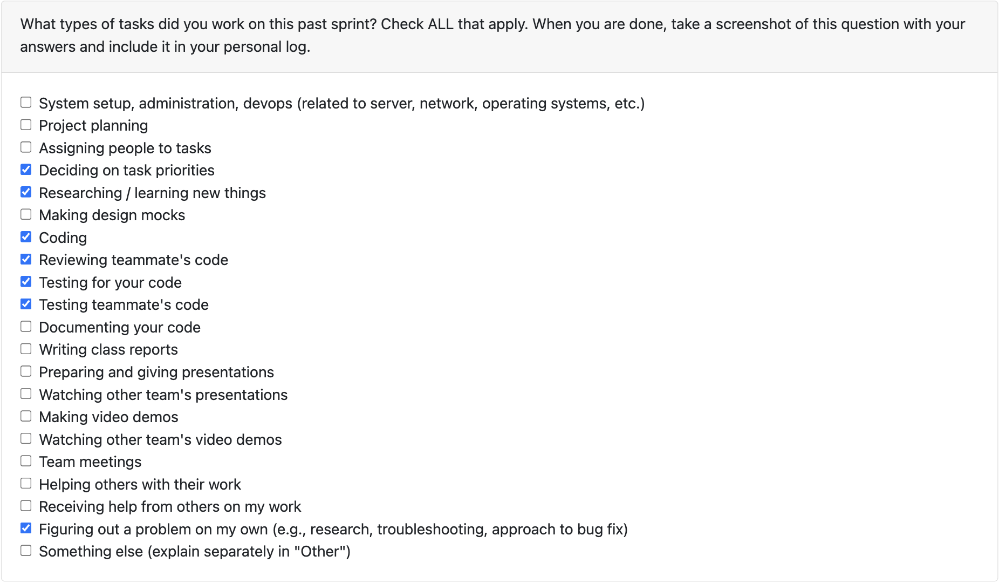

---

# Personal logs of Will Tilden (from Week 14) as per the personal log format outlined in lecture slides

## Applicable date range
- Monday, December 1st to Sunday, December 7th

## Type of tasks I worked on
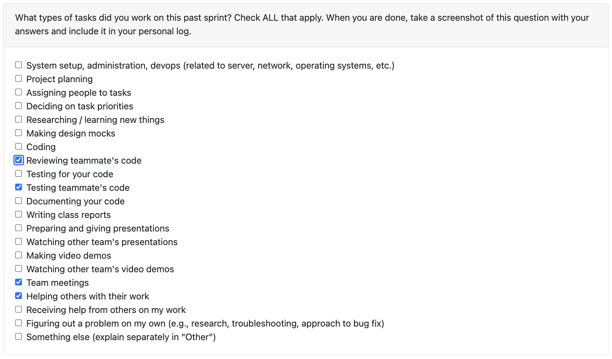

## Recap on your weeks goals

- Which features were yours in the project plan for this milestone?

    I did not complete a contirbution this week I got completely overwhelmed studying for a final exam that I have tomorrow so that is on me.

- Which tasks from the project board are associated with these features?

    n/a

- Among these tasks, which have you completed / in progress in the last 2 weeks?

    n/a

- Optional text: additional context that we should be aware of

     My fault I didn't contribute this week just have a couple exams very early in the exam period so got overwhelmed and let it slip. My fault. 

- Working on in the next sprint

    I'd like to work on the export to PDF and make it a lot more customizable and clean for the user to get exactly what they want presented on there I think that would be really fun and interesting to work on.

# Personal logs of Will Tilden (from Week 12) as per the personal log format outlined in lecture slides
# Personal logs of Will Tilden (from Week 13) as per the personal log format outlined in lecture slides

## Applicable date range
- Monday, November 24th to Sunday, November 30th

## Type of tasks I worked on
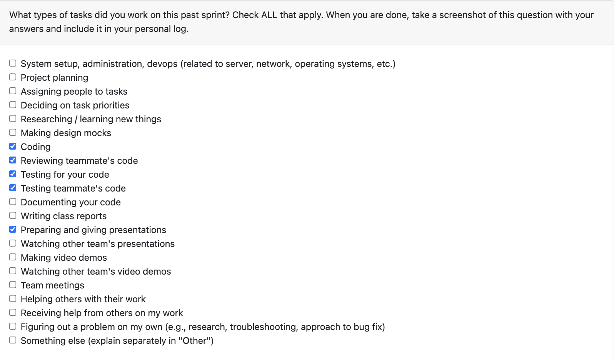

## Recap on your weeks goals

- Which features were yours in the project plan for this milestone?

    I had issue 130 which was to add functionality such that both the ML data and the LLM data would be included in the PDF export when applicable if the user consented to the use of the LLM to analyze their data. This involved changes to the main file, refactoring the export function in the pdf exporter file to be able to handle the response from the llm, as well as driving this development with additional tests.

- Which tasks from the project board are associated with these features?

    The associated issue is issue [COSC-499-W2025/capstone-project-team-15#130](https://github.com/COSC-499-W2025/capstone-project-team-15/issues/130)

- Among these tasks, which have you completed / in progress in the last 2 weeks?

    I started and compeleted this issue this week.

- Optional text: additional context that we should be aware of

     This I think was one of my strongest weeks and I am proud of that. I made a strong contribution, I added tests that drove my development, I made two reviews on other people's PR's and was the first reviewer on one of those, and helped to test some of my other teammates code as well.

- Working on in the next sprint

    I believe this is our last sprint before the winter break? I could be confused but if not I would like to work more on the pdf exporter as I found it quite fun and interesting. The exported PDF is currently clean and straightforward but there is a lot of room for improvement and customization / personalization to the particular user.

# Personal logs of Will Tilden (from Week 12) as per the personal log format outlined in lecture slides

## Applicable date range
- Monday, November 17th to Sunday, November 23rd

## Type of tasks I worked on
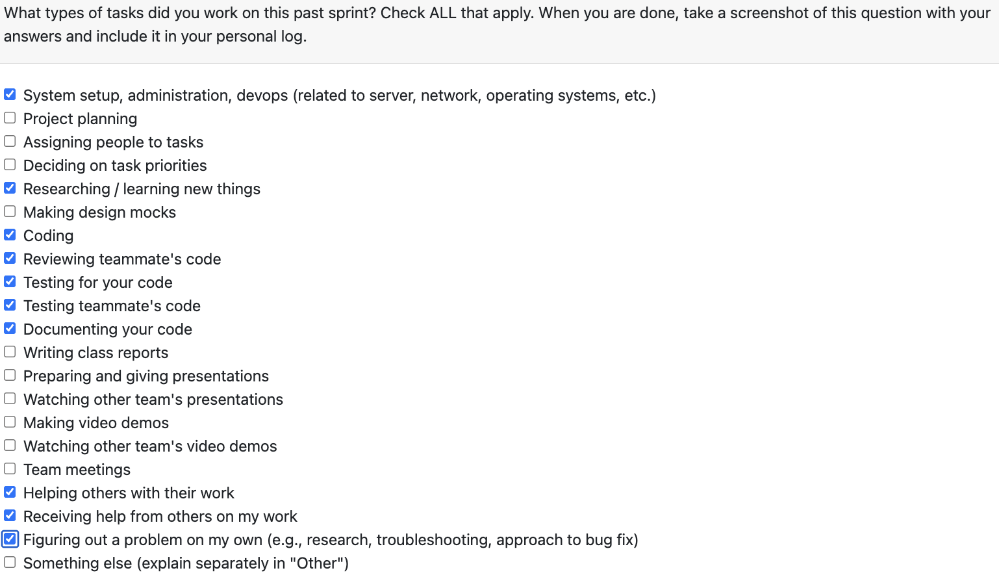

## Recap on your weeks goals

- Which features were yours in the project plan for this milestone?

    This week my contribution and associated issue was finding a way to automatically get the DB tables added to the DB container upon setup of the container. This required editing the docker-compose.yml and adding a script that would wait until the DB container was successfully running and ready for a connection, and then having the yml file trigger the create_tables script in order to have them added automatically upon building the containers. This brings us one step closer to a fully connect pipeline.

- Which tasks from the project board are associated with these features?

    The associated issue is issue [COSC-499-W2025/capstone-project-team-15#115](https://github.com/COSC-499-W2025/capstone-project-team-15/issues/115)

- Among these tasks, which have you completed / in progress in the last 2 weeks?

    This issue was completed and closed this week by me with some help from Cole.

- Optional text: additional context that we should be aware of

     N/A

- Working on in the next sprint

    I'll be working together with the guys to go over the whole pipeline, make sure that all the indiviual components are working properly, being well tested, and are connecting properly to create a full pipeline. Basically with it being the last week before milestone #1 is due, we will essentially be checking over everything to make sure it is all working properly and that nothing was missed, etc. So it will be a busy but fun week.

# Personal log of Will Tilden (from Week 10) as per the personal log format outlined in lecture slides

## Applicable date range
- Monday, November 3rd to Sunday, November 9th

## Type of tasks I worked on
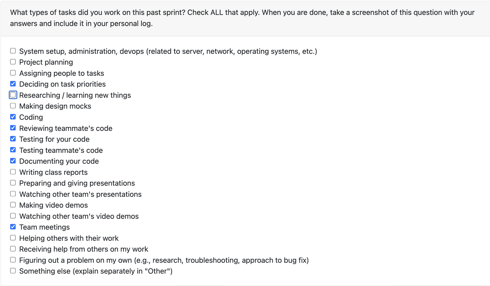

## Recap on your weeks goals

- Which features were yours in the project plan for this milestone?

    I had issue 76 which was the updates to the docker files which I mostly compelted last week but forgot to update the read me doc as well as move the environment variable into an env as opposed to uploading them into the repo, so that is the switch that I made for this week were those two things which now that they are finished makes the issue closed and completed.

- Which tasks from the project board are associated with these features?

    From the project board issue #76 titled docker setup improvements.

- Among these tasks, which have you completed / in progress in the last 2 weeks?

    This issue was created last week and mostly completed last week but as I mentioned I forgot these two things and so now it is all done and can be marked closed and I'll be looking for my next task this following week. 

- Optional text: additional context that we should be aware of

     None for this week, group feels good, I think we'll have a bit of a busies few weeks after reading week just getting everything pulled together for milestone 1 but I think that this team will work well together towards getting everything put together on time. I'm looking forward to the challenge.

- Working on in the next sprint

    - I'll be working together with the whole team to piece together our pipeline and get it working to a point where we can run containers, upload a zip, pass to the parser and then the ML... etc. basically getting all of the individual components working together to a point where we can feel reasonably close to being complete milestone 1.

# Personal log of Will Tilden (from Week 8) as per the personal log format outlined in lecture slides

## Applicable date range
- Monday, October 20th to Sunday, October 26th

## Type of tasks I worked on
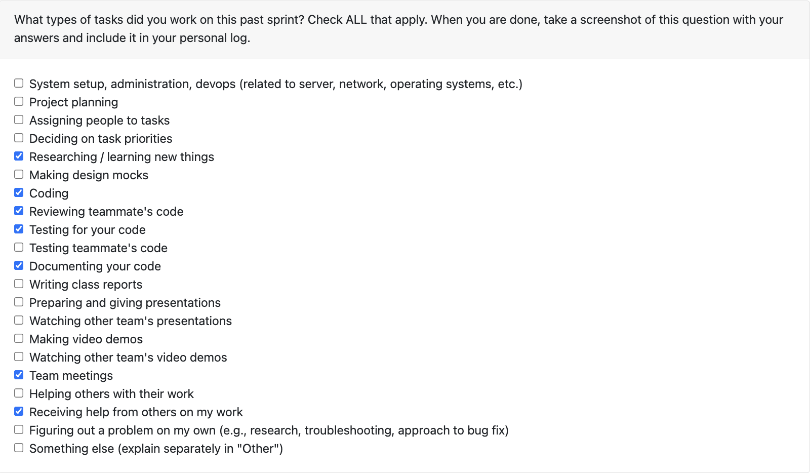

## Recap on your weeks goals

- Which features were yours in the project plan for this milestone?

    This week my feature was to setup all of the necessary docker files so that we are ready to run our app in a docker container when the time comes to begin running it and testing it. Right now it is instead setup to run a test file (which is the test file I used to make sure my docker files were working properly) just to ensure that it is all setup properly but once we're ready to run the app in a docker container, we now have all the files in place to be able to do that which is a helpful step towards milestone 1 completion.

- Which tasks from the project board are associated with these features?

    From the project board issue [COSC-499-W2025/capstone-project-team-15#62](https://github.com/COSC-499-W2025/capstone-project-team-15/issues/62) is the one that I completed this week with my pull request.

- Among these tasks, which have you completed / in progress in the last 2 weeks?

    This issue was created and completed by me this week.

- Optional text: additional context that we should be aware of

     None for this week, I felt I made a storng contirbution to an important part of getting the app going and it is good to have it done ✅
     
# Personal log of Will Tilden (from Week 7) as per the personal log format outlined in lecture slides

## Applicable date range
- Monday, October 13th to Sunday, October 19th

## Type of tasks I worked on

## Recap on your weeks goals

- Which features were yours in the project plan for this milestone?

    This week my feature was #1 in the milestone requirements which specifies to ensure that the user is asked for their consent before their data is analyzed so I added the functionality to prompt the user for their consent before we analyzed their data. And I added tests to ensure this functionality works properly. I also mistakenly forgot to pull in our team logs from week 6 which was last week. They were my responsibility and I did them on time, I just forgot to pull them into the branch so we got a zero so I am going to get those pulled in and see if I may still be able to get them marked because I don't want to have let my team down there.

- Which tasks from the project board are associated with these features?

    From the project board issue [COSC-499-W2025/capstone-project-team-15#41](https://github.com/COSC-499-W2025/capstone-project-team-15/issues/41) is associated with the obtaining of the users consent for data analysis that i mentioned. And the issue associated with pulling in last weeks team logs is issue[COSC-499-W2025/capstone-project-team-15#43](https://github.com/COSC-499-W2025/capstone-project-team-15/issues/43).

- Among these tasks, which have you completed / in progress in the last 2 weeks?

    Both have been completed this week and are merged in now and marked done.

- Optional text: additional context that we should be aware of

     My mistake forgetting to merge in the team logs was an honest one and I do feel bad for letting my team down there so I am really hoping that, now that they are merged in, that someone may be able to go back and review them again so we may get the marks 🙏🏻.

# Personal log of Will Tilden (from Week 6) as per the personal log format outlined in lecture slides

## Applicable date range
- Monday, October 6th to Sunday, October 12th

## Type of tasks I worked on
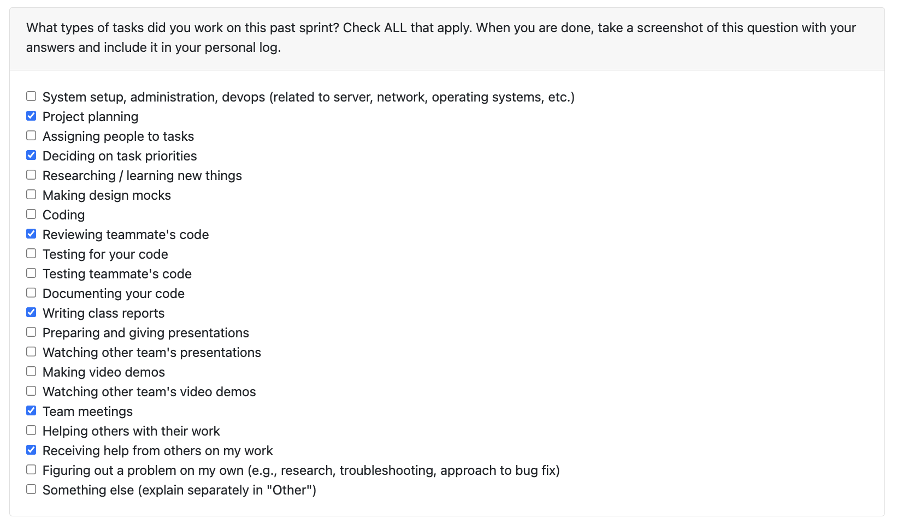

## Recap on your weeks goals

- Which features were yours in the project plan for this milestone?

    I did issue 27 which was a documanation update on the project proposal document, and also helped others with their PRs doing reviews and giving suggestions.

- Which tasks from the project board are associated with these features?

    Issue 27 and the associated PR were mine for this week.

- Among these tasks, which have you completed / in progress in the last 2 weeks?

    The issue was completed today and is done now so into coding next week.

- Optional text: additional context that we should be aware of

     N/A

# Personal log of Will Tilden (from Week 5) as per the personal log format outlined in lecture slides

## Applicable date range
- Monday, September 29th to Sunday, October 5th

## Type of tasks I worked on
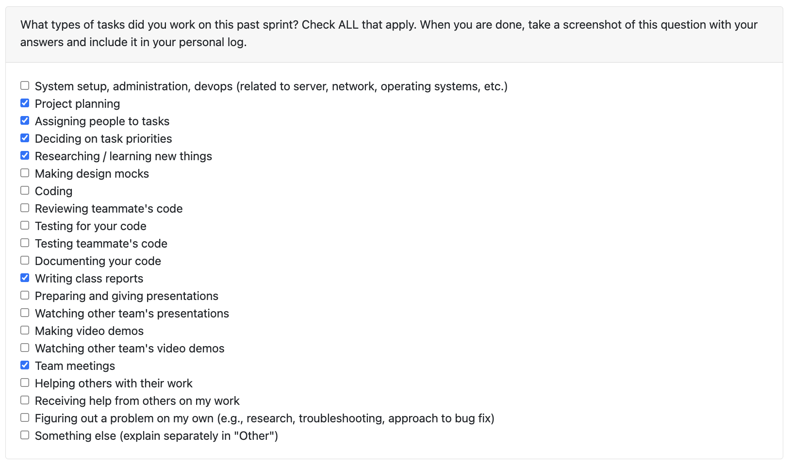

## Recap on your weeks goals

- Which features were yours in the project plan for this milestone?

    I helped the team work on the DFD diagram.

- Which tasks from the project board are associated with these features?

    DFD Explanation is the name of the associated issue.

- Among these tasks, which have you completed / in progress in the last 2 weeks?

    We completed this one, the DFD explanation, as well as the system architecture diagram.

- Optional text: additional context that we should be aware of

     N/A

# Personal log of Will Tilden (from Week 4) as per the personal log format outlined in lecture slides

## Applicable date range
- Monday, September 22nd to Sunday, September 28th

## Type of tasks I worked on
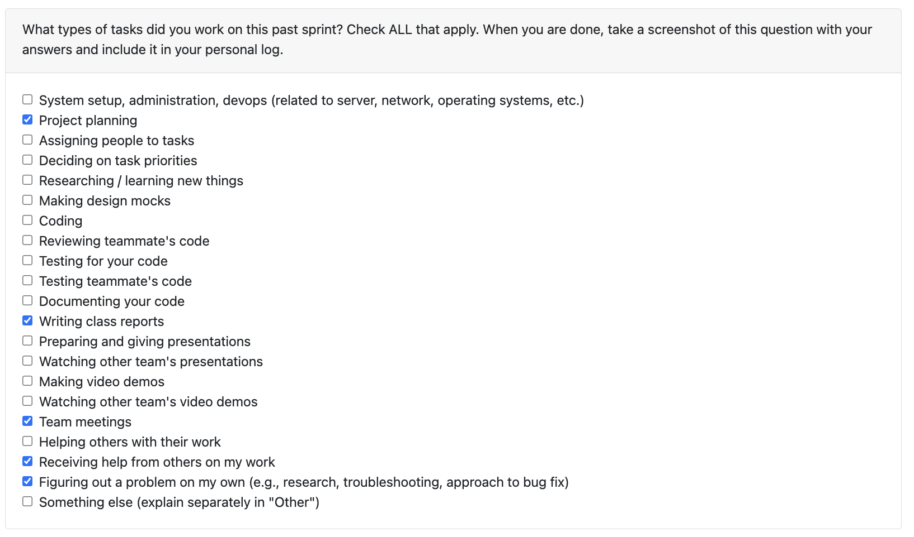

## Recap on your weeks goals

- Which features were yours in the project plan for this milestone?

    I was working on the project proposal and the system architecture diagram along with the rest of the team which we finished well and on time.

- Which tasks from the project board are associated with these features?

    These features, the proposal and system architecture diagram, were recorded as issues in our github repository and have all team members listed on them as assignees.

- Among these tasks, which have you completed / in progress in the last 2 weeks?

    This week we completed both the project proposal and the system architecture diagram and next week we will move on to the data flow diagram.

- Optional text: additional context that we should be aware of

    Another good week with a good team! Looking forward to working with this team throughout the year.

# Personal log of Will Tilden (from Week 3)

## What went well

- Team seems to work well together so far similar mindset and determination to do well on the project
- We got along well not just as like a team but we can have fun together which I think is important for a long term project like this one

## What didn’t go well

- The requirements gathering activity, while I believe I understand the intetion behind it, didn't feel terribly useful just given that a lot of the time was spent repeating requirements back at each other that teams already had themselves, I think I would have preffered having requirements given to us and just getting on writing the code sooner personally

## Planning for the next cycle

- Clarify and solidify requirements to the point that they are ready to inform coding / building decisions
- Delegate roles and responsibilities as far as who should work on which part(s) of the app
- Develop a sprint structure and cycle of some kind to keep the team synchronized and organized in moving forward with the project at the right pace and in an organized fashion

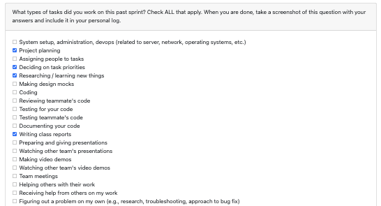
