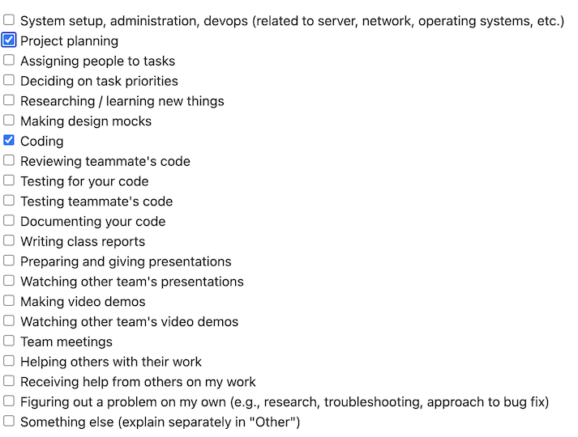

# Alex Taschuk Personal Logs Term 2

## Table of Contents

**[Week 1, Jan. 05 – 11](#week-1-jan-05--11)**

**[Week 2, Jan. 12 – 18](#week-2-jan-12--18)**

---

## Week 1, Jan. 05 – 11

### Peer Eval

### Recap

This week, I wrapped up the rest of the Alembic integration that I worked on over break. I still have not made a PR for the feature however because Sam's PRs have not been reviewed and merged yet. I also talked with the team about what our expectations are for the next milestone.

## Week 2, Jan. 12 – 18

### Peer Eval

### Recap

This week, I met with the team to refine what we need as a team to do for this milestone and what we need to do individually. I was assigned the team leader for the database side of our project, which means that I will be putting more focus towards the database for this milestone than others. Addtionally, I will be working on the frontend team to help design the frontend, and on the API migration team to help design, and implement an API, and migrate our current database towards one that uses a REST API.

I also created a couple of database-related issues that I will begin working on next week. One of them covers significant changes that need to be made for the database's structure and configuration, so it may take more than one week for its PR.

Lastly, I created a PR for the Alembic integration that I completed over winter break. The PR can be accessed [here](https://github.com/COSC-499-W2025/capstone-project-team-18/pull/356).

Here are the PRs that I reviewed this week:

- [#351 Decouple Start Miner Logic from the CLI and make Service Outline, Sam](https://github.com/COSC-499-W2025/capstone-project-team-18/pull/351#pullrequestreview-3675793062)
- [#355 Initialize API, Sam](https://github.com/COSC-499-W2025/capstone-project-team-18/pull/355)
- [#363 Error thrown by logging.py if not ran in the src directory, Jimi](https://github.com/COSC-499-W2025/capstone-project-team-18/pull/363)