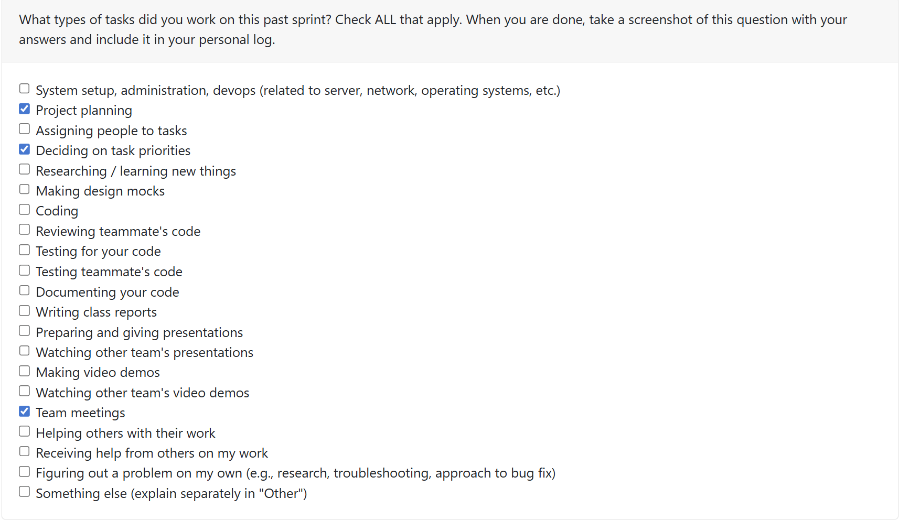
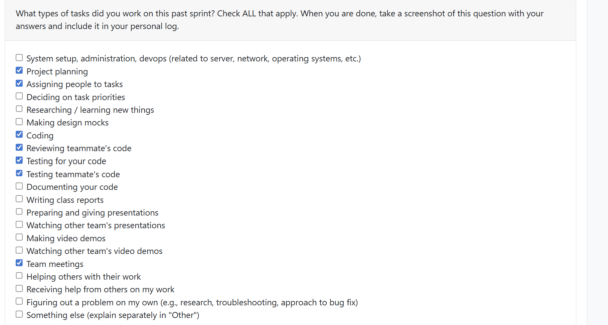

# Priyansh Mathur Personal Logs Term 2

## Table of Contents

**[Week 1, Jan. 05-11](#week-1-jan-05-11)**

**[Week 2, Jan. 12-18](#week-2-jan-12-18)**

---

## Week 1, Jan. 05-11

### Peer Eval

### Recap
This week, our team reconvened after the break to reassess where we stood with Milestone 1. We discussed our individual progress, highlighted areas that needed improvement, and confirmed the remaining tasks required to complete the milestone. We have also started planning and discussing Milestone 2 requirments. Additionally I reviewed PR #341 Tawana Term 2 Week 1 Personal Log and PR #322 Refactor Test Directory by Sam

## Week 2, Jan. 12-18

### Peer Eval

### Recap

Building on the planning and coordination from Week 1, this week focused on divison of teams to handle tasks for Milestone 2.

#### Coding Tasks

I completed [PR #364 - Extract README Key Phrases to Auto‑Tag Projects](https://github.com/COSC-499-W2025/capstone-project-team-18/pull/364), which closes [Issue #359](https://github.com/COSC-499-W2025/capstone-project-team-18/issues/359). This PR implements sophisticated README analysis using three ML models:

- **KeyBERT** for extracting key phrases and technical tags from README content
- **BERTopic** for discovering project themes through topic modeling across multiple README files
- **BART-MNLI** for zero-shot tone classification (technical, casual, educational, promotional)

The implementation aggregates README insights at the project level and surfaces them in portfolio output. I created comprehensive docstrings for all functions, implemented error handling for BERTopic edge cases (e.g., zero-size arrays when insufficient documents exist)

#### Reviewing Tasks

I reviewed two critical PRs this week:

1. [PR #356 - Implement DB Migration & Version Control via Alembic](https://github.com/COSC-499-W2025/capstone-project-team-18/pull/356) by Alex

2. [PR #358 - Fix Contribution Percentage Bug](https://github.com/COSC-499-W2025/capstone-project-team-18/pull/358) by Sam

#### Goals for Next Week
- Continue work on Milestone 2 features, involving additional ML support and analysis
- Support the team with any Milestone 1 deliverables and documentation