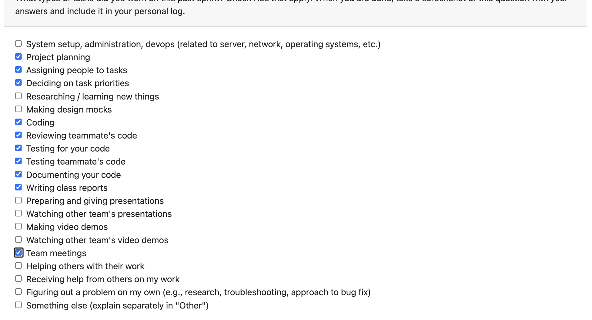
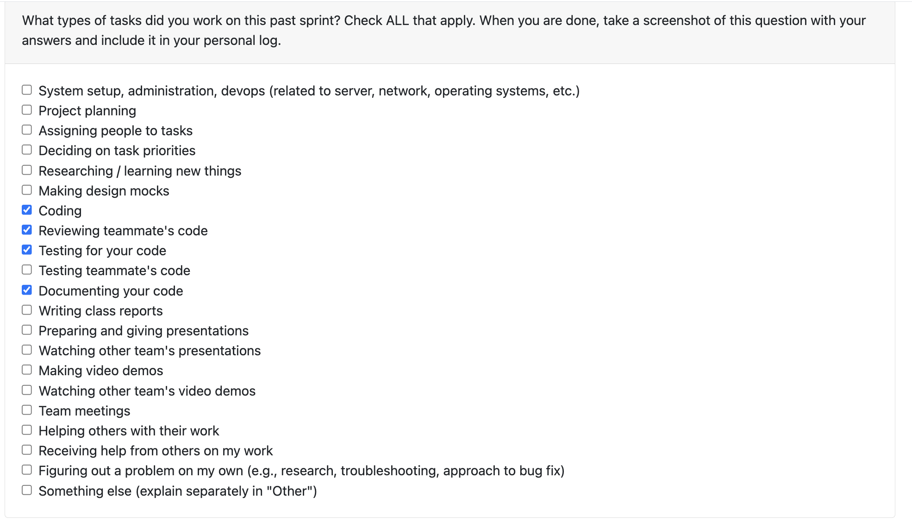
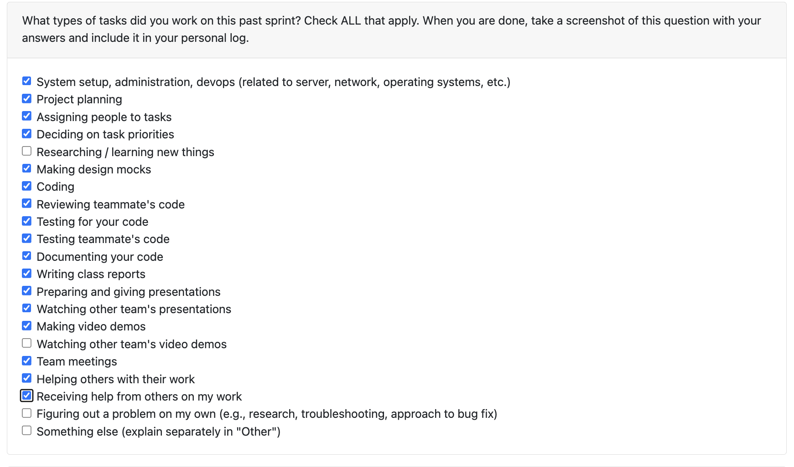
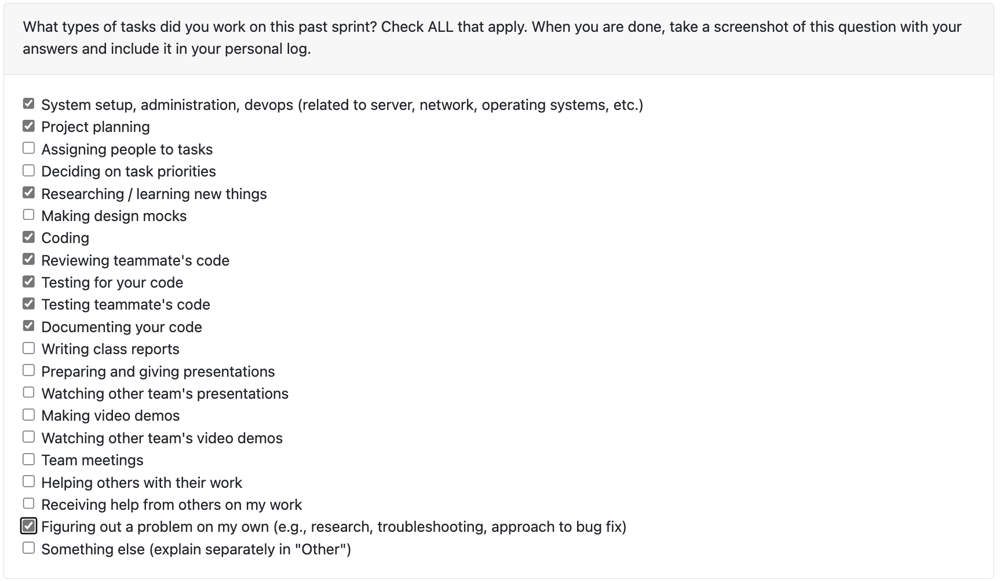

# Sam Sikora Personal Logs Term 2

## **[This Week](#week-11--12-316---330)**

## Table of Contents
- **[Week 11 & 12, 3/16 - 3/30](#week-11--12-316---330)**
- **[Week 10, 3/9 - 3/15](#week-10-39---315)**
- **[Week 9, 3/2 - 3/8](#week-9-32---38)**
- **[Week 8, 2/23 - 3/1](#week-8223---31)**
- **[Week 4-5 01/26 - 02/08](#week-4-5-0126---0208)**
- **[Week 3 01/19 - 01/25](#week-3-0119-0125)**
- **[Week 2, 01/12 - 01/18](#week-2-0112---0118)**
- **[Week 1, 01/05 - 01/11](#week-1-0105---0111--winter-break)**

---

## Week 11 & 12 (3/16 - 3/30)

### Coding Tasks

Over the past two weeks, I focused mainly on the Portfolio and a new unquie feature of project insights.

For the portoflio, I created the web download and the portoflio edit page including support project cards and project showcase. The portfolio on the frontend is highly editable including adding and removing editable tags. I also created support for the project thumbnail in the portoflio.

I refactor and overhauled the project view page. Instead of showing raw JSON, I presented facts and figures to the user about their projects/

I also created a new unquie feature of project insights. I built the backend class structure, endpoint, and database management, then followed it up with the full frontend. I also refactored the resume bullet points to use action verb + subject + outcome phrasing, and updated the skill count figures to be cumulative and log-scaled.

- [PR #482 Created Project Insights Class Structure, Endpoint, Database Management, and Tests](https://github.com/COSC-499-W2025/capstone-project-team-18/pull/482)
- [PR #496 Consistent Error Handling and Documentation in the API](https://github.com/COSC-499-W2025/capstone-project-team-18/pull/496)
- [PR #497 Small bug fix](https://github.com/COSC-499-W2025/capstone-project-team-18/pull/497)
- [PR #499 Portfolio Structural Changes for Sorting and Web Download](https://github.com/COSC-499-W2025/capstone-project-team-18/pull/499)
- [PR #500 Front End Portfolio Changes](https://github.com/COSC-499-W2025/capstone-project-team-18/pull/500)
- [PR #531 Support for Front End Project Thumbnails](https://github.com/COSC-499-W2025/capstone-project-team-18/pull/531)
- [PR #533 Front-End Portfolio Edit Page](https://github.com/COSC-499-W2025/capstone-project-team-18/pull/533)
- [PR #545 Resume Bullet Point Refactor](https://github.com/COSC-499-W2025/capstone-project-team-18/pull/545)
- [PR #550 Project View Page Refactor](https://github.com/COSC-499-W2025/capstone-project-team-18/pull/550)
- [PR #552 Project Insights Frontend](https://github.com/COSC-499-W2025/capstone-project-team-18/pull/552)
- [PR #555 Figures are Log Scaled with Cumulative Totals](https://github.com/COSC-499-W2025/capstone-project-team-18/pull/555)

### Testing Tasks

Each PR included pytest and vitest tests. The Project Insights backend included both endpoint tests and unit tests for the new calculator/generator pattern and vitest passed for each PR.

### Review Tasks

I reviewed the following PRs:

- [PR #523 Electron Skeleton UI & Loading Loop](https://github.com/COSC-499-W2025/capstone-project-team-18/pull/523)
- [PR #526 GitHub Pages Deployment](https://github.com/COSC-499-W2025/capstone-project-team-18/pull/526)
- [PR #529 Figures, Plots & Timelines (frontend)](https://github.com/COSC-499-W2025/capstone-project-team-18/pull/529)
- [PR #534 Resume Front End Suite](https://github.com/COSC-499-W2025/capstone-project-team-18/pull/534)
- [PR #544 Added new Skill Timeline, Adjusted Contribution Map, and ensured exporting of all figures](https://github.com/COSC-499-W2025/capstone-project-team-18/pull/544)
- [PR #549 Frontend for Job Readiness Feature](https://github.com/COSC-499-W2025/capstone-project-team-18/pull/549)
- [PR #557 Small changes to Profile page](https://github.com/COSC-499-W2025/capstone-project-team-18/pull/557)
- [PR #558 Changing to light mode](https://github.com/COSC-499-W2025/capstone-project-team-18/pull/558)

---

## Week 10 3/9 - 3/15

## Coding Tasks

I implemented the ProjectInsights class structure and management.

[PR Created Project Insights Class Structure, Endpoint, Database Management, and Tests #482](https://github.com/COSC-499-W2025/capstone-project-team-18/pull/482)

### Testing Tasks

Wrote tests for the PR that tests the endpoint without running server.

### Review Tasks

I reviewed the following PRs:

[480 interactive mock interview mode for job specific interview preparation #483](https://github.com/COSC-499-W2025/capstone-project-team-18/pull/483)
[467 add education and awards to user config and resume generation #484](https://github.com/COSC-499-W2025/capstone-project-team-18/pull/484)

### Summary

This week, I focused a lot on creating and defining other issues for the group to complete. In the following issues ([#475](https://github.com/COSC-499-W2025/capstone-project-team-18/issues/475), [#476](https://github.com/COSC-499-W2025/capstone-project-team-18/issues/476), [#477](https://github.com/COSC-499-W2025/capstone-project-team-18/issues/477), [#478](https://github.com/COSC-499-W2025/capstone-project-team-18/issues/478), [#479](https://github.com/COSC-499-W2025/capstone-project-team-18/issues/479), [#481](https://github.com/COSC-499-W2025/capstone-project-team-18/issues/481)) I created in depth descriptions and implmentation ideas for the issues. Also, I worked on creating a new system called ProjectInsights which would help prompt a user on ideas to write in their resume.

## Week 9 3/2 - 3/8

## Coding Tasks

The coding task I did do implemented a project thumbnail which was missing from the Milestone #2.

[PR #469 Upload Project Thumbnail Endpoint](https://github.com/COSC-499-W2025/capstone-project-team-18/pull/469)

### Testing Tasks

Wrote tests for the PR that tests the endpoint without running server.

### Review Tasks

I reviewed the following PRs:

[PR #464](https://github.com/COSC-499-W2025/capstone-project-team-18/pull/464)
[PR #463](https://github.com/COSC-499-W2025/capstone-project-team-18/pull/463)
[PR #461](https://github.com/COSC-499-W2025/capstone-project-team-18/pull/461)

### Summary

Because of my large time coding tasks and time commitment last week, I was only able to get one coding task achieved for this week. However, I have now caught up to my other work and I am looking forward to getting back into this project.

## Week 8 2/23 - 3/1

### Coding Tasks

This week, I filled a lot of holes that were needed for Milestone 2. The biggest of which was the use cases for the portfolio object. While I had designed the portfolio system, I needed to hook the system up to the API and database. Besides that PR, I created a skills endpoint, documented our endpoints, updated the README, and refactor a ML pipline to use the new Azure models.

[PR #434 Major Use Cases for the Portofolio Object](https://github.com/COSC-499-W2025/capstone-project-team-18/pull/434)
[PR #435 Get Skills Endpoint](https://github.com/COSC-499-W2025/capstone-project-team-18/pull/434)
[PR #442 Extra Documentation for Endpoints](https://github.com/COSC-499-W2025/capstone-project-team-18/pull/442)
[PR #445 Commit Contributions to Azure](https://github.com/COSC-499-W2025/capstone-project-team-18/pull/445)
[PR #452 Readme updates](https://github.com/COSC-499-W2025/capstone-project-team-18/pull/452)

### Testing Tasks

Each PR was test or was documentation.

### Review Tasks

I reviewed the following PRs:

[PR #451](https://www.google.com/url?sa=E&source=gmail&q=https://github.com/COSC-499-W2025/capstone-project-team-18/pull/451)
[PR #450](https://www.google.com/url?sa=E&source=gmail&q=https://github.com/COSC-499-W2025/capstone-project-team-18/pull/450)
[PR #446](https://www.google.com/url?sa=E&source=gmail&q=https://github.com/COSC-499-W2025/capstone-project-team-18/pull/446)
[PR #444](https://www.google.com/url?sa=E&source=gmail&q=https://github.com/COSC-499-W2025/capstone-project-team-18/pull/444)
[PR #441](https://www.google.com/url?sa=E&source=gmail&q=https://github.com/COSC-499-W2025/capstone-project-team-18/pull/441)
[PR #440](https://www.google.com/url?sa=E&source=gmail&q=https://github.com/COSC-499-W2025/capstone-project-team-18/pull/440)
[PR #437](https://www.google.com/url?sa=E&source=gmail&q=https://github.com/COSC-499-W2025/capstone-project-team-18/pull/437)
[PR #429](https://www.google.com/url?sa=E&source=gmail&q=https://github.com/COSC-499-W2025/capstone-project-team-18/pull/429)
[PR #429](https://www.google.com/url?sa=E&source=gmail&q=https://github.com/COSC-499-W2025/capstone-project-team-18/pull/429)

## Summary

Milestone 2 is done woo hoo!

## Week 4-5 01/26 - 02/08

### Coding Tasks

One PR this week focused on creating a portfolio class system that can support user edits, incremental additions, and a conflict managment system to handle when the two conflict. Another PR created an entirely new database system to support API development and ensure we don't have to rebuild the database schema every time. Lastly, I added a small PR to optimize our testing environment to quickly run without ML tests during development, but running the full suite on PR creation.

- [PR #383 Portfolio Class System](https://github.com/COSC-499-W2025/capstone-project-team-18/pull/383)
- [PR #412 New Database System](https://github.com/COSC-499-W2025/capstone-project-team-18/pull/412)
- [PR #397 Optimize Tests](https://github.com/COSC-499-W2025/capstone-project-team-18/pull/397)

### Testing Tasks

I wrote a comphersensive tests for both of my big PRs, and also restructed how tests are run in the PR mentioned above.

### Review Tasks

I reviewed the following PRs:

- [PR #411](https://github.com/COSC-499-W2025/capstone-project-team-18/pull/411)
- [PR #409](https://github.com/COSC-499-W2025/capstone-project-team-18/pull/409)
- [PR #401](https://github.com/COSC-499-W2025/capstone-project-team-18/pull/401)
- [PR #391](https://github.com/COSC-499-W2025/capstone-project-team-18/pull/391)
- [PR #388](https://github.com/COSC-499-W2025/capstone-project-team-18/pull/388)
- [PR #381](https://github.com/COSC-499-W2025/capstone-project-team-18/pull/381)
- [PR #411](https://github.com/COSC-499-W2025/capstone-project-team-18/pull/411)

### Summary

As talked about last week these weeks were focused on big architercure changes the portfolio system and an entire DB rework. Moving forward, look to start getting specific requirements for Milestone #2 done. I will do this by levelaging these new changes.

## Week 3 01/19-01/25

### Coding Tasks

This week my PR's focused adding robustness to our system for the upcoming API. This included making sure that the start_miner function could handle project level errors instead of just erroring out, making sure that the miner would only mine to the project level, and simplifying the passing of data in our code (PR #378). Also, I created a entire new class system to handle portfolios. This ensure that we have a system to update, incrementaly add, and resolve conflicts with our portfilo objects.

- [PR #378 Robust start_miner_service](https://github.com/COSC-499-W2025/capstone-project-team-18/pull/378)
- [PR #383 Portfolio Class Sytem](https://github.com/COSC-499-W2025/capstone-project-team-18/pull/383)

### Testing Tasks

I added tests for each of my PRs and apated existing tests to deal with the movement of logic.

### Review Tasks

I reviewed the following PRs
- [PR #381 ML-based contribution pattern analysis for commit classification, work patterns, and collaboration roles](https://github.com/COSC-499-W2025/capstone-project-team-18/pull/381)
- [PR #377 Alembic hotfix, created initial revision file for the database](https://github.com/COSC-499-W2025/capstone-project-team-18/pull/377)

### Summary

This week focused on big sweeping architecure additions and changes. However, with this new changes, it should be really easy to create endpoints for our API. Next week will focus on getting endpoints developed.

## Week 2 01/12 - 01/18

### Coding Tasks

This week my PR's from winter break that I mentioned last week were all reviewed and merged. See last week's log for details, but this includes:
- [PR #329 Logic for Serializing and Deserializing Statistic Values](https://github.com/COSC-499-W2025/capstone-project-team-18/pull/329)
- [PR #330 Capsulate Project and User Report Statistic Logic Analysis](https://github.com/COSC-499-W2025/capstone-project-team-18/pull/330)
- [PR #332 Refactor Test Directory](https://github.com/COSC-499-W2025/capstone-project-team-18/pull/332)
- [PR #333 Log Everything](https://github.com/COSC-499-W2025/capstone-project-team-18/pull/333)

Additionaly, I also adapted the logic of the project upload or start_miner function so that it was decoupled from the CLI, and thus could be run stateless from by an API in the future. ([#351](https://github.com/COSC-499-W2025/capstone-project-team-18/pull/351)).

I also configured and initialized the FastAPI service. This also included writing placeholder functions for all the endpoints required by Milestone #2 ([#355](https://github.com/COSC-499-W2025/capstone-project-team-18/pull/355)).

### Testing Tasks

I added tests to the API PR to make sure all Milestone #2 required endpoints existed and ran properly, and a very simple API ping to verify the service was running.

For the decoupling, I had to write some new unzip util functions so I added tests for all the new helper functions I wrote ([#351](https://github.com/COSC-499-W2025/capstone-project-team-18/pull/351)).

I also commited tests onto Jimi's bug fix PR to make sure that it we had a test for this bug and it doesn't happen again ([#358](https://github.com/COSC-499-W2025/capstone-project-team-18/pull/358)).

### Review Tasks

I reviewed Alex's PR [#356](https://github.com/COSC-499-W2025/capstone-project-team-18/pull/356) and Priyansh's PR [#364](https://github.com/COSC-499-W2025/capstone-project-team-18/pull/364)

### Summary

Last week was about getting huge refactors in to give us a clean slate. Now I am focusing on thinking about the big architercure changes that will allow us to best deliever on Milestone #2. I am the lead of the API team, so I will be focused on getting some endpoints delivered.

## Week 1 01/05 - 01/11 + Winter Break

I worked mainly on refactoring our code. I mostly focused on making and implementing consistent conventions and taking god classes and spliting the responsiblities into many different, refactorable code pieces. Specially, I split our report and analyzer code pieces into different files (#321), I added an empty file check before we analyzed files (#327), I created a one size fits all serializer and deserializer for the database (#329), I adapted the way we calcuated statistics to prevent shotgun changes when adding new statistics (#330), refactor the entire tests folder to split the tests up into logical subfolders and making sure the tests use the same, consistent helper functions (#332), and lastly I added support for logging through the system and added log messages (#333).
