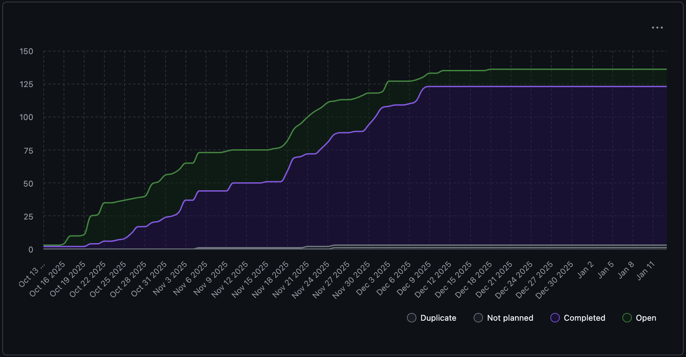

# Team 18 Term 2 — Week 1, Jan. 05-11

## Overview

### Milestone Goals
During the winter break and continuing into the first week of Term 2, the team focused on large-scale refactoring, architectural cleanup, and system robustness. This period was intentionally used to address accumulated technical debt and restructure core components of the application to support long-term extensibility. 

The emphasis was on modularity, test reliability, performance safeguards, and maintainability. As a result, multiple foundational PR's were completed or are currently awaiting merge approval. 

### Burnup Chart



## Details

### Username Mapping

```
jademola -> Jimi Ademola
eremozdemir -> Erem Ozdemir
thndlovu -> Tawana Ndlovu
alextaschuk -> Alex Taschuk
sjsikora -> Sam Sikora
priyansh1913 -> Priyansh Mathur
```

### Completed Tasks

The following PR's were merged:

- [#321 Split report.py and analyzer.py into single files](https://github.com/COSC-499-W2025/capstone-project-team-18/pull/321)
- [#327 Adding Empty File Check to Specific Code Analyzers](https://github.com/COSC-499-W2025/capstone-project-team-18/pull/327)

### In progress

The following PR's are currently awaiting merge approval or have requested changes pending review:

- [#329 Logic for Serializing and Deserializing Statistic Values](https://github.com/COSC-499-W2025/capstone-project-team-18/pull/329)
- [#330 Capsulate Project and User Report Statistic Logic Analysis](https://github.com/COSC-499-W2025/capstone-project-team-18/pull/330)
- [#332 Refactor Test Directory](https://github.com/COSC-499-W2025/capstone-project-team-18/pull/332)
- [#333 Adds a consistent way to get a logger object through the new get_logger function](https://github.com/COSC-499-W2025/capstone-project-team-18/pull/333)


