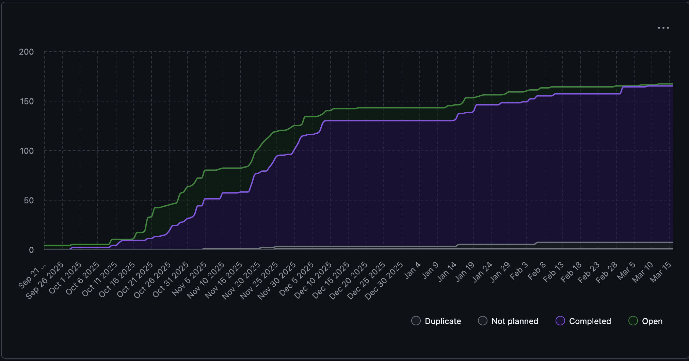

# Team 18 Term 2 — Week 3, Jan. 19-25

## Overview

### Milestone Goals
Continuing from the first week of Term 2, the team focused on large-scale refactoring, additonal requirements and methods of analysis, bugfixes and UI integration with a new API. This period was used to bridge a couple current gaps in the project. These were specifically creating more dynamic analysis, adding a refined user interface and varying developer-based improvements.

The emphasis was on performace improvements, test reliability, back->front end integeration, and maintainability. As a result, multiple foundational PR's were completed or are currently awaiting merge approval.

### Burnup Chart



## Details

### Username Mapping

```
jademola -> Jimi Ademola
eremozdemir -> Erem Ozdemir
thndlovu -> Tawana Ndlovu
alextaschuk -> Alex Taschuk
sjsikora -> Sam Sikora
priyansh1913 -> Priyansh Mathur
```

### Completed Tasks

The following PR's were merged:

- [#480 interactive mock interview mode for job specific interview preparation](https://github.com/COSC-499-W2025/capstone-project-team-18/pull/480)


### In progress

The following PR's are currently awaiting merge approval or have requested changes pending review:


- [#490 Front-End Development](https://github.com/COSC-499-W2025/capstone-project-team-18/pull/490)
- [#485 Get GROUP BASED statistics](https://github.com/COSC-499-W2025/capstone-project-team-18/pull/485)
- [#467 add education and awards to user config and resume generation](https://github.com/COSC-499-W2025/capstone-project-team-18/pull/484)
- [#482 Created Project Insights Class Structure, Endpoint, Database Management, and Tests](https://github.com/COSC-499-W2025/capstone-project-team-18/pull/482)


