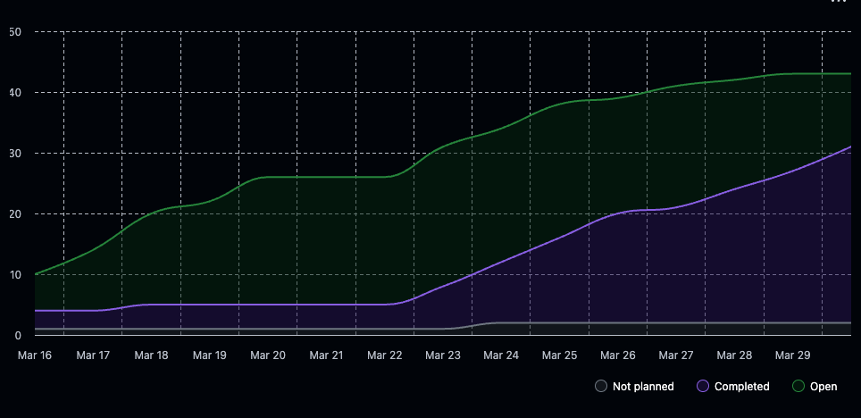

# Team 18 Term 2 — Week 11 & 12

## Overview

### Burnup Chart



## Details

### Username Mapping

```
jademola -> Jimi Ademola
eremozdemir -> Erem Ozdemir
thndlovu -> Tawana Ndlovu
alextaschuk -> Alex Taschuk
sjsikora -> Sam Sikora
priyansh1913 -> Priyansh Mathur
```

### Summary of this week

Starting week 11, our group had a deadline of peer testing to meet on the 18th. We needed a large amount of our UI done by then. Tawna, who was our previous front end lead spearheaded a mock UI for a dashboard and resume view, while Sam worked on the portoflio changes. After peer testing the work was then divide among group memebers again based on missing milestone three deliervables and feedback. Specially, here was the issue expectation for each group memeber:

### Assigned to: eremozdemir
* [Frontend Support for Education, Skills, and Awards](https://github.com/COSC-499-W2025/capstone-project-team-18/issues/506)
* [Resume: Add Skills Categorized by expertise level](https://github.com/COSC-499-W2025/capstone-project-team-18/issues/481)

### Assigned to: jademola
* [Create Backend System that is Capable of Creating Figures](https://github.com/COSC-499-W2025/capstone-project-team-18/issues/479)
* [Error occurs if reanalyzing project currently](https://github.com/COSC-499-W2025/capstone-project-team-18/issues/433)

### Assigned to: priyansh1913
* [Add Machine Learning Consent Flag](https://github.com/COSC-499-W2025/capstone-project-team-18/issues/493)

### Assigned to: sjsikora
* [Bug: Git Contributions Not Working in Frontend](https://github.com/COSC-499-W2025/capstone-project-team-18/issues/504)

### Assigned to: thndlovu
* [Frontend Support for Project Thumbnails](https://github.com/COSC-499-W2025/capstone-project-team-18/issues/505)
* [Electron Skeleton UI & Loading Loop](https://github.com/COSC-499-W2025/capstone-project-team-18/issues/503)
* [Resume Front End Suite](https://github.com/COSC-499-W2025/capstone-project-team-18/issues/508)

### Assigned to: alex
Wasn't assigned anything, but created the User Github OAuth Flow in this time frame.

Most of those issues where achieved by March 21st, and all were wrapped up by March 25th for the M3 presentation. In this presentatio each group member tackled a topic they worked on, and we met to pratice. After our presentation, our main priorty was to ensure everything was finished for the upcoming video demo on March 29th. While almost every requirement in M3 was completed, there were many different UI wants commuciated by the group and many oppurunties we saw for improvement. So, everyone was divided into a feature that matched their skill set and background, and we started hammering the features we had left. See the specific PRs in the table below.

Over these two weeks here is the summary in which each group memeber contributed:

Sam - Project Insights feature both backend architecture and frontend, Portoflio page edit and static web download
Alex - Github OAuth Feature, General App UI cleanup
Erem - Resume education and awards and light mode
Jimi - Created backend and frontend figures for the portfolio, fixed bugs with duplicate project analysis, created profile page
Tawana - Resume Rendering, Resume view and edit page and loading page loop
Priyansh Interactive mock interview change and expanded project insights.

### Completed Tasks

#### Week 11 (Mar 16–22)

| PR | Title | Author | Merged |
|----|-------|--------|--------|
| [#483](https://github.com/COSC-499-W2025/capstone-project-team-18/pull/483) | Interactive mock interview mode | Priyansh | Mar 16 |
| [#484](https://github.com/COSC-499-W2025/capstone-project-team-18/pull/484) | Add education & awards to user config and resume generation | Erem | Mar 16 |
| [#485](https://github.com/COSC-499-W2025/capstone-project-team-18/pull/485) | Get group-based statistics | Jimi | Mar 16 |
| [#482](https://github.com/COSC-499-W2025/capstone-project-team-18/pull/482) | Project Insights class structure, endpoint, DB management & tests | Sam | Mar 17 |
| [#490](https://github.com/COSC-499-W2025/capstone-project-team-18/pull/490) | Peer testing frontend dev | Tawana | Mar 17 |
| [#497](https://github.com/COSC-499-W2025/capstone-project-team-18/pull/497) | Small bug fix | Sam | Mar 18 |
| [#496](https://github.com/COSC-499-W2025/capstone-project-team-18/pull/496) | Consistent error handling & API documentation | Sam | Mar 20 |
| [#499](https://github.com/COSC-499-W2025/capstone-project-team-18/pull/499) | Portfolio structural changes (sorting & web download) | Sam | Mar 20 |
| [#500](https://github.com/COSC-499-W2025/capstone-project-team-18/pull/500) | Front end portfolio changes | Sam | Mar 20 |
| [#502](https://github.com/COSC-499-W2025/capstone-project-team-18/pull/502) | Peer testing endpoint connection | Tawana | Mar 20 |
| [#507](https://github.com/COSC-499-W2025/capstone-project-team-18/pull/507) | Resume: add skills categorized by expertise level | Erem | Mar 20 |
| [#515](https://github.com/COSC-499-W2025/capstone-project-team-18/pull/515) | Hotfix: missing div tag on homepage | Alex | Mar 21 |

#### Week 12 (Mar 23–30)

| PR | Title | Author | Merged |
|----|-------|--------|--------|
| [#517](https://github.com/COSC-499-W2025/capstone-project-team-18/pull/517) | User GitHub OAuth Flow | Alex | Mar 23 |
| [#518](https://github.com/COSC-499-W2025/capstone-project-team-18/pull/518) | Add more project insights | Priyansh | Mar 23 |
| [#516](https://github.com/COSC-499-W2025/capstone-project-team-18/pull/516) | Add ML consent flag | Priyansh | Mar 24 |
| [#519](https://github.com/COSC-499-W2025/capstone-project-team-18/pull/519) | Fix duplicate project analysis | Jimi | Mar 24 |
| [#522](https://github.com/COSC-499-W2025/capstone-project-team-18/pull/522) | Frontend for skills, education & awards | Erem | Mar 25 |
| [#523](https://github.com/COSC-499-W2025/capstone-project-team-18/pull/523) | Electron Skeleton UI & Loading Loop | Tawana | Mar 25 |
| [#526](https://github.com/COSC-499-W2025/capstone-project-team-18/pull/526) | GitHub Pages deployment | Alex | Mar 25 |
| [#531](https://github.com/COSC-499-W2025/capstone-project-team-18/pull/531) | Frontend support for project thumbnails | Sam | Mar 25 |
| [#529](https://github.com/COSC-499-W2025/capstone-project-team-18/pull/529) | Figures, plots & timelines (frontend) | Jimi | Mar 26 |
| [#533](https://github.com/COSC-499-W2025/capstone-project-team-18/pull/533) | Front-End Portfolio Edit Page | Sam | Mar 26 |
| [#534](https://github.com/COSC-499-W2025/capstone-project-team-18/pull/534) | Resume Front End Suite | Tawana | Mar 26 |
| [#543](https://github.com/COSC-499-W2025/capstone-project-team-18/pull/543) | Fixed GitHub noreply emails counting separately from user contributions | Alex | Mar 27 |
| [#545](https://github.com/COSC-499-W2025/capstone-project-team-18/pull/545) | Resume Bullet Point Refactor | Sam | Mar 28 |
| [#547](https://github.com/COSC-499-W2025/capstone-project-team-18/pull/547) | App UI Cleanup | Alex | Mar 28 |
| [#544](https://github.com/COSC-499-W2025/capstone-project-team-18/pull/544) | New skill timeline, adjusted contribution map, export all figures | Jimi | Mar 29 |
| [#549](https://github.com/COSC-499-W2025/capstone-project-team-18/pull/549) | Frontend for job readiness feature | Priyansh | Mar 29 |
| [#550](https://github.com/COSC-499-W2025/capstone-project-team-18/pull/550) | Project View Page Refactor | Sam | Mar 29 |
| [#551](https://github.com/COSC-499-W2025/capstone-project-team-18/pull/551) | Settings Modal → Profile Page | Jimi | Mar 29 |
| [#552](https://github.com/COSC-499-W2025/capstone-project-team-18/pull/552) | Project Insights Frontend | Sam | Mar 29 |
| [#555](https://github.com/COSC-499-W2025/capstone-project-team-18/pull/555) | Figures log-scaled with cumulative totals | Sam | Mar 29 |
| [#557](https://github.com/COSC-499-W2025/capstone-project-team-18/pull/557) | Small changes to Profile page | Alex | Mar 29 |
| [#558](https://github.com/COSC-499-W2025/capstone-project-team-18/pull/558) | Changing to light mode | Erem | Mar 30 |

### Next Steps

With the video demo, the project is now done. We will try to identify bugs, write documentation and polish the user experience in the next week to ensure the project is cleanly finsihed!
