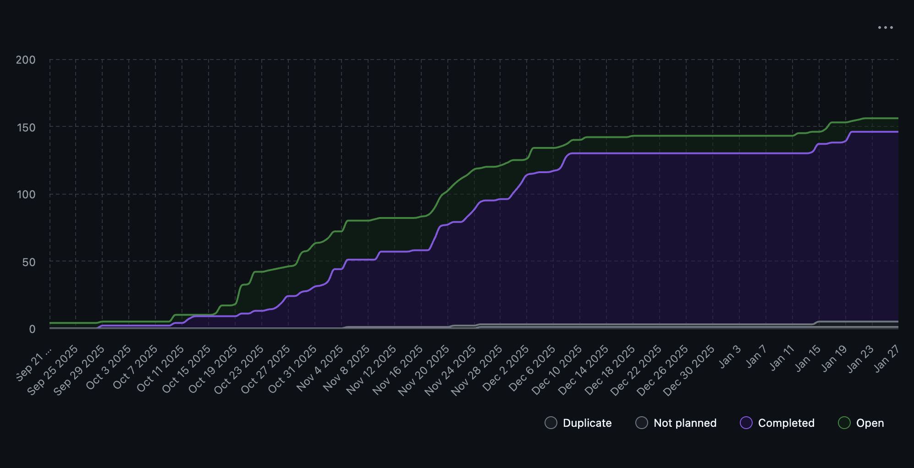

# Team 18 Term 2 — Week 3, Jan. 19-25

## Overview

### Milestone Goals
Continuing from the first week of Term 2, the team focused on large-scale refactoring, additonal requirements and methods of analysis, bugfixes and UI integration with a new API. This period was used to bridge a couple current gaps in the project. These were specifically creating more dynamic analysis, adding a refined user interface and varying developer-based improvements.

The emphasis was on performace improvements, test reliability, back->front end integeration, and maintainability. As a result, multiple foundational PR's were completed or are currently awaiting merge approval.

### Burnup Chart



## Details

### Username Mapping

```
jademola -> Jimi Ademola
eremozdemir -> Erem Ozdemir
thndlovu -> Tawana Ndlovu
alextaschuk -> Alex Taschuk
sjsikora -> Sam Sikora
priyansh1913 -> Priyansh Mathur
```

### Completed Tasks

The following PR's were merged:

- [#381 ML-based contribution patterns](https://github.com/COSC-499-W2025/capstone-project-team-18/pull/381)
- [#380 Improve README insights](https://github.com/COSC-499-W2025/capstone-project-team-18/pull/380)
- [#372 Project setup refactoring](https://github.com/COSC-499-W2025/capstone-project-team-18/pull/372)
- [#380 Robust start_miner_service](https://github.com/COSC-499-W2025/capstone-project-team-18/pull/378)
- [#380 Alembic hotfix](https://github.com/COSC-499-W2025/capstone-project-team-18/pull/377)

### In progress

The following PR's are currently awaiting merge approval or have requested changes pending review:

- [#383 Portfolio Class System](https://github.com/COSC-499-W2025/capstone-project-team-18/pull/383)
- [#388 Initialize Electron UI](https://github.com/COSC-499-W2025/capstone-project-team-18/pull/388)
- [#391 Store INFO_FILES](https://github.com/COSC-499-W2025/capstone-project-team-18/pull/391)
- [#393 Handle duplicate files](https://github.com/COSC-499-W2025/capstone-project-team-18/pull/393)


