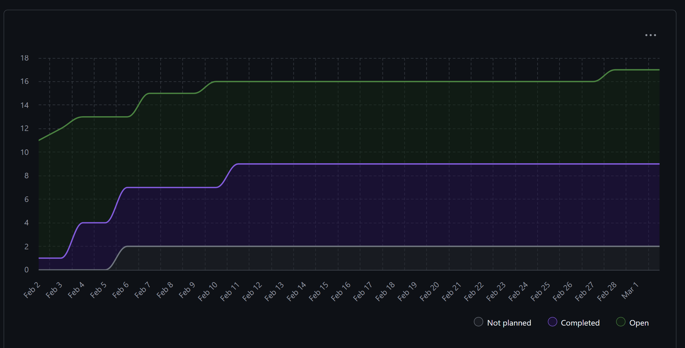

# Team 18 Term 2 — Week 8, Feb. 22 – Mar. 1

## Overview

### Milestone Goals
This week focused on completing all the Milestone 2 Requirments which included expanding API coverage for all the workflows, integrating Azure-backed ML generation, improving UI visibility for project and skills pages, and stabilizing the refactored miner folder structure and tests.

### Burnup Chart



## Details

### Username Mapping

```
jademola -> Jimi Ademola
eremozdemir -> Erem Ozdemir
thndlovu -> Tawana Ndlovu
alextaschuk -> Alex Taschuk
sjsikora -> Sam Sikora
priyansh1913 -> Priyansh Mathur
```

### Completed Tasks

- [#453 Log 8](https://github.com/COSC-499-W2025/capstone-project-team-18/pull/453)
- [#452 Readme updates](https://github.com/COSC-499-W2025/capstone-project-team-18/pull/452)
- [#451 Customize And Save Information About A Portfolio Showcase Project](https://github.com/COSC-499-W2025/capstone-project-team-18/pull/451)
- [#450 HOTFIX: PosixPath Error](https://github.com/COSC-499-W2025/capstone-project-team-18/pull/450)
- [#449 Jimi's Week 8 Log](https://github.com/COSC-499-W2025/capstone-project-team-18/pull/449)
- [#448 Erem Week 8 logs](https://github.com/COSC-499-W2025/capstone-project-team-18/pull/448)
- [#447 Hotfix](https://github.com/COSC-499-W2025/capstone-project-team-18/pull/447)
- [#446 Allow report updates](https://github.com/COSC-499-W2025/capstone-project-team-18/pull/446)
- [#445 Commit Contributions to Azure](https://github.com/COSC-499-W2025/capstone-project-team-18/pull/445)
- [#444 Display Textual Information About A Project As A Resume Item](https://github.com/COSC-499-W2025/capstone-project-team-18/pull/444)
- [#443 Week 8 log](https://github.com/COSC-499-W2025/capstone-project-team-18/pull/443)
- [#442 Extra Documentation for Endpoints](https://github.com/COSC-499-W2025/capstone-project-team-18/pull/442)
- [#441 Display Textual Information About A Project As A Portfolio Showcase](https://github.com/COSC-499-W2025/capstone-project-team-18/pull/441)
- [#440 Upgrade ML Generation Pipeline to Azure OpenAI for Portfolio Outputs](https://github.com/COSC-499-W2025/capstone-project-team-18/pull/440)
- [#438 Fix `FILE_HASH` merge conflicts](https://github.com/COSC-499-W2025/capstone-project-team-18/pull/438)
- [#437 410 Post proj upload & privacy consent endpoints](https://github.com/COSC-499-W2025/capstone-project-team-18/pull/437)
- [#435 Get Skills Endpoint](https://github.com/COSC-499-W2025/capstone-project-team-18/pull/435)
- [#434 Major Use Cases for the Portfolio Object](https://github.com/COSC-499-W2025/capstone-project-team-18/pull/434)
- [#431 Put `src` and `tests` in `miner`](https://github.com/COSC-499-W2025/capstone-project-team-18/pull/431)
- [#429 416 resume endpoints](https://github.com/COSC-499-W2025/capstone-project-team-18/pull/429)
- [#425 Add basic Electron UI with projects and skills Pages](https://github.com/COSC-499-W2025/capstone-project-team-18/pull/425)


